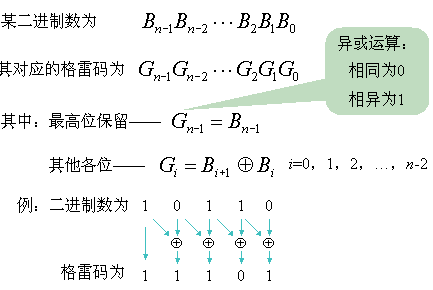
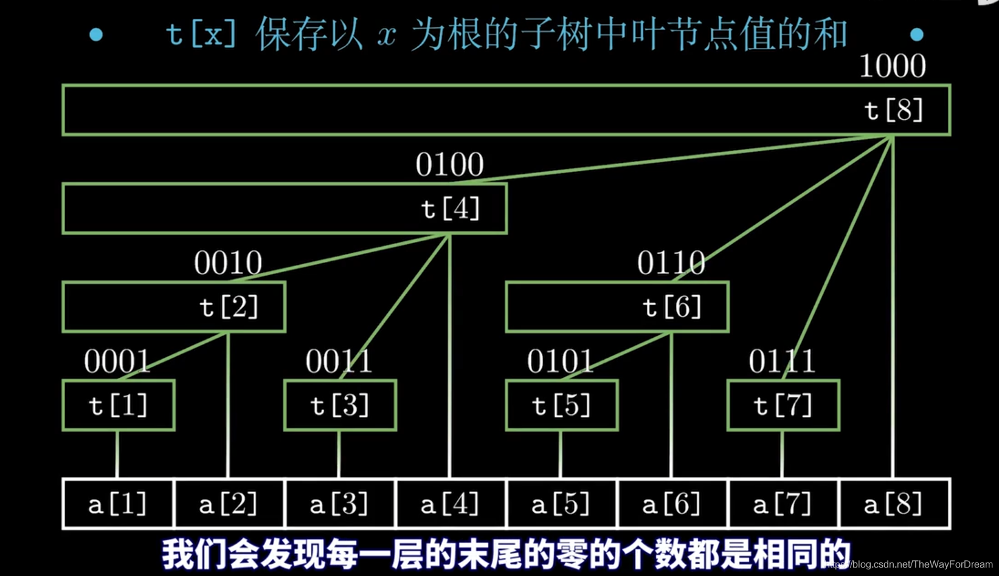
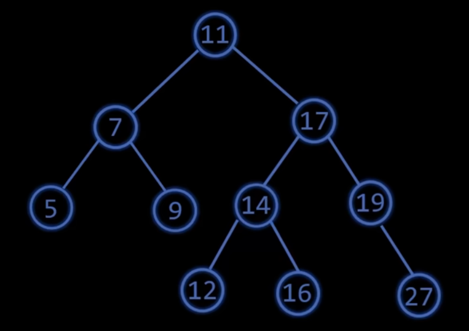
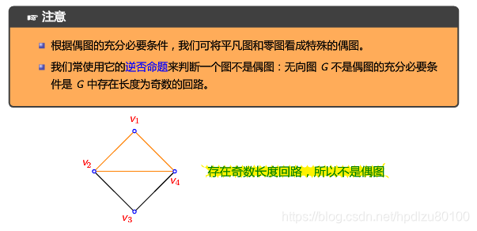
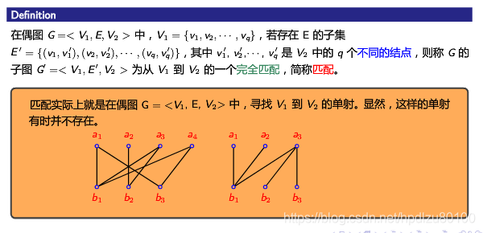
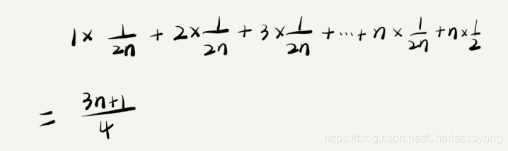

# 《全国青少年信息学奥林匹克系列竞赛大纲》知识点整理

[TOC]

## 2.1 入门级

### 2.1.1 基础知识与编程环境

### 2.1.2 C++ 程序设计

#### 1、程序基本概念

##### 编辑、编译、解释、调试的概念

###### 编辑

编辑是指编写程序代码的过程。程序员使用文本编辑器或集成开发环境（IDE）来创建、编辑和保存程序源代码文件。在编辑代码时，程序员可以使用代码补全、语法高亮、代码折叠等功能来提高效率。

```
IDE：
集成开发环境，一般包括代码编辑器、编译器、调试器和图形用户界面工具。集成了代码编写功能、分析功能、编译功能、调试功能等一体化的开发软件服务套。所有具备这一特性的软件或者软件套(组)都可以叫集成开发环境。

每种编程语言都有一些特定的IDE，如学习C/C++/C# 推荐微软强大的Visual Studio系列，CodeBlocks等；学习JAVA推荐Eclipse，IntelliJ Idea和NetBeans等；学习Python 推荐 PyCharm，WingIDE，python官方支持的集成开发环境idle（轻量级）等。
```

###### 编译

编译是将程序源代码转换为可执行文件的过程。**编译器**是用于执行编译过程的工具，它将源代码转换为机器代码，这些机器代码可以在计算机上执行。编译器通常会进行词法分析、语法分析、语义分析等操作来检查代码的正确性，并生成可执行代码。

```
编译器：
把源代码转换成（翻译）低级语言的程序，一个现代编译器的主要工作流程：源代码 (source code) → 预处理器 (preprocessor) → 编译器 (compiler) → 目标代码 (object code) → 链接器 (Linker) → 可执行程序 (executables)。
常用编译器如Dev-C++，WIN-TC，TurboC，MinGW等。
源代码一般为高级语言 (High-level language)， 如Pascal、C、C++、Java、汉语编程等或汇编语言，而目标则是机器语言的目标代码，有时也称机器代码。
一句话描述编译与解释
编译：将一种语言（源码）转换成另一种语言（目标代码/计算机代码），发生在运行之前，产物是「另一份代码」，交给别人执行。
解释：把程序源代码一行一行的读懂然后执行，发生在运行时，产物是「运行结果」。
```


###### 解释

解释是将程序代码**逐行**转换为机器代码并立即执行的过程。解释器是执行解释过程的工具，它可以直接读取源代码文件，逐行解释并执行代码。解释器可以在不需要编译的情况下执行代码，但解释的速度通常比编译的速度慢。

```
解释器：
直接把高级编程语言一行一行转译运行，重点是不会一次把整个程序转译出来，因此运行速度比较缓慢，它每转译一行程序就立刻运行，然后再转译下一行，再运行，如此不停地进行下去。
```

###### 调试

调试是在程序运行时查找和修复错误的过程。调试器是用于执行调试过程的工具，它可以在程序运行时暂停执行、检查变量值、跟踪函数调用等。调试器可以帮助程序员定位并修复程序中的错误，提高程序的质量和可靠性。

> https://yncoders.com/show/73
> https://www.bilibili.com/read/cv13258034/

#### 2、基本数据类型

#### 3、程序基本语句

#### 4、基本运算

#### 5、数学库常用函数

```c++
#include <cmath>
```

##### 绝对值函数、四舍五入函数、下取整函数、 上取整函数、平方根函数、常用三角函数、对数函数、指数函数

###### 绝对值函数 `abs(x)`

功能：返回参数 x 的绝对值。

```c++
int a = -5;
int b = abs(a);// b=5
double c = -5.2;
double d = abs(c)//d=5.2
```

###### 四舍五入函数 `round(x)`

功能：返回参数 x 的四舍五入值。

```c++
double a = 3.4;
double b = 3.6;
int c = round(a);// c=3
int d = round(b);// d=4
```

###### 下取整函数 `floor(x)`

功能：返回不大于参数 x 的最大整数。

```c++
double a = 3.4;
double b = 3.6;
int c = floor(a);// c=3
int d = floor(b);// d=3
```

###### 上取整函数 `ceil(x)`

功能：返回不小于参数 x 的最小整数。

```c++
double a = 3.4;
double b = 3.6;
int c = ceil(a);// c=4
int d = ceil(b);// d=4
```

###### 平方根函数 `sqrt(x)` 

功能：表示求一个数的平方根。

```c++
double x = 4.0;
double y = sqrt(x);//计算 4 的平方根
```

###### 常用三角函数

在直角三角形中，当平面上的三点A、B、C的连线，AB、AC、BC，构成一个 直角三角形，其中∠ACB为 直角。对∠BAC而言， 对边(opposite)a=BC、 斜边(hypotenuse)c=AB、邻边(adjacent)b=AC，则存在以下关系：

| 基本函数   | 英文         | 缩写     | c++函数                      | 表达式（$\theta$为∠A的角度（弧度制）） | 语言描述             |
| ---------- | ------------ | -------- | ---------------------------- | -------------------------------------- | -------------------- |
| 正弦函数   | *sine*       | *sin*    | sin(x)                       | $sin(\theta) = a/c$                    | ∠A的对边比斜边       |
| 余弦函数   | *cosine*     | *cos*    | cos(x)                       | $cos(\theta) = b/c$                    | ∠A的邻边比斜边       |
| 正切函数   | *tangent*    | *tan*    | tan(x)                       | $tan(\theta) = a/b$                    | ∠A的对边比邻边       |
| 余切函数   | *cotangent*  | *cot*    | pow(tan(x) , -1) or 1/tan(x) | $cot(\theta) =b/a$                     | ∠A的邻边比对边       |
| 正割函数   | *secant*     | *sec*    | pow(cos(x) , -1) or 1/cos(x) | $sec(\theta) = c/b$                    | ∠A的斜边比邻边       |
| 余割函数   | *cosecant*   | *csc*    | pow(sin(x) , -1) or 1/sin(x) | $csc(\theta) = c/a$                    | ∠A的斜边比对边       |
| 反正弦函数 | *arcsine*    | *arcsin* | asin(x)                      | $\theta=arcsin(a/c)$                   | 求解给定正弦值的角度 |
| 反余弦函数 | *arccosine*  | *arccos* | acos(x)                      | $\theta=arccos(b/c)$                   | 求解给定余弦值的角度 |
| 反正切函数 | *arctangent* | *arctan* | atan(x)                      | $\theta=arctan(a/b)$                   | 求解给定正切值的角度 |


```c++
double x = 1.0;//弧度制
double y = sin(x);// 计算 sin(x) 
double z = tan(x);// 计算 tan(x)
```

###### 对数函数

`log`：自然对数

`log10`：以 10 为底的对数

`log2` ：以 2 为底的对数

```c++
double x = 10.0;
double b = log(x);//计算 ln(x)
double c = log10(x);// 计算 log10(x)
double d = log2(x);// 计算 log2(x)
```

###### 指数函数

`exp(x)`：计算自然指数函数 e^x 的值（e 约等于 2.71828）。

`pow(base, exponent)`：计算 base 的 exponent 次幂的值。

`exp2(x)`：计算 2 的 x 次幂的值。

`pow(base, 0.5)`：计算 base 的平方根。

```C++
double x = 1.0;
double y = exp(x);// 计算 e^x
```

> https://blog.csdn.net/chaotiantian/article/details/115029466
> https://baike.baidu.com/item/%E5%BC%A7%E5%BA%A6%E5%88%B6/3315973

#### 6、结构化程序设计

#### 7、数组

#### 8、字符串的处理

#### 9、函数与递归

#### 10、结构体与联合体

#### 11、指针类型

#### 12、文件及基本读写

#### 13、STL 模板

##### 栈 (stack)、队列 (queue)、链表 (list)、向量（vector）等容器

详细打开[C++提高编程.pdf](./C++提高编程.pdf)

### 2.1.3 数据结构

### 2.1.4 算法

#### 1、算法概念与描述

##### 算法描述：自然语言描述、流程图描述、伪代码描述

###### 自然语言描述

通过自然语言来描述算法的步骤和操作。

例如，冒泡排序算法的自然语言描述：

从数组的第一个元素开始，依次比较相邻的两个元素，如果前一个元素大于后一个元素，则交换它们的位置，直到将最大的元素移动到数组的最后一个位置。重复上述操作，直到所有元素都排好序为止。

###### 流程图描述

通过图形化方式来表示算法的步骤和操作。

例如，冒泡排序算法的流程图描述：


流程图中图形的表示含义


###### 伪代码描述

通过一种类似编程语言的语法来描述算法的步骤和操作。伪代码通常比自然语言描述更具体和精确。

例如，冒泡排序算法的伪代码描述：

```c++
procedure bubbleSort(A : list of sortable items)
    n = length(A)
    repeat
        swapped = false
        for i = 1 to n-1 do
            if A[i] > A[i+1] then
                swap(A[i], A[i+1])
                swapped = true
            end if
        end for
        n = n - 1
    until not swapped
end procedure
```

以上三种方式都可以用来描述算法，它们**各有优缺点**，选择哪种方式主要取决于具体情况和个人偏好。在实践中，通常使用**自然语言描述和伪代码**描述来表示算法。

#### 2、入门算法

#### 3、基础算法

##### 倍增法（binary lifting）

介绍：倍增法（binary lifting），顾名思义就是翻倍。它能够使线性的处理转化为对数级的处理，大大地优化时间复杂度。这个方法在很多算法中均有应用，其中最常用的是 RMQ 问题和求 LCA（最近公共祖先）。倍增”与“二进制划分”两个思想相互结合，降低了求解很多问题的时间与空间复杂度。快速幂其实就是“倍增”与“二进制划分”思想的一种体现。其他应用还有，序列上的倍增问题，求解RMQ（区间最值）问题的ST算法，求解最近公共祖先（LCA）等。

基本用法：

倍增主要用途是为了**查找单调数据组中某一数值**。

比如：在一个数组a {2,5,7,11,19} 中查找最大的小于12的数字。

（1）朴素做法：从第一个数开始，一个一个往后枚举，查找。

（2）二分做法：每次将数列分割一半判断，并且进一步查找子区间。

（3）倍增做法：设定一个增长长度 p 和已确定长度 l，现在要确定 a[l+p] 是否满足条件，若满足条件（比12小），则p成2倍增长；否则 p 缩小范围（试着缩小范围判断条件）。

```c++
l=0;
p=1;
while(p){//如果还能扩增范围(l)就继续
    if(a[l+p]<12){
        l+=p;//增加已知范围
        p<<=1//成倍增长，相当于p*=2
    }
    else{
        p>>=1;//缩小范围
    }
}
cout<<a[l];
```

倍增算法一般比较稳定，时间 O(logn)。

###### ST算法

```
ST算法(Sparse Table algorithm, ST)的基本步骤如下:
1、预处理:
    创建一个二维数组dp,其中dp[i][j]表示从下标i开始长度为2^j的区间内的最大值(或最小值)。
    通过动态规划的方式计算dp数组。对于任意i和j,dp[i][j] = max(dp[i][j-1], dp[i+2^(j-1)][j-1])(或最小值)。
    这样可以在O(nlogn)的时间内预处理完dp数组。
2、查询:
    给定一个查询区间[l, r],我们可以找到一个最大的k,使得2^k <= r-l+1。
    此时,区间[l, r]可以被分解为两个长度为2^k的区间,即[l, l+2^k-1]和[r-2^k+1, r]。
    查询这两个区间的最大值(或最小值),取其中的较大值(或较小值)即可。这个过程只需O(1)的时间复杂度。
```

###### 最近公共祖先（LCA）

```
最近公共祖先(Lowest Common Ancestor, LCA)

给定一颗有根树，若节点 z 既是节点 x 的祖先，也是节点 y 的祖先，则称 z 是 x，y 的公共祖先。在 x，y 的所有共公共祖先中，深度最大的一个称为 x，y 的最近公共祖先，记为 LCA(x,y)。

LCA(x,y) 是 x 到根的路径与 y 到根的路径的交汇点，它也是 x 与 y 之间的路径上深度最小的节点。

这里着重介绍树上倍增法求LCA。

树上倍增法是一个很重要的算法。除了求 LCA 之外，它在很多问题中都有广泛应用。设 F[x,k] 表示 x 的 2^k 辈祖先，即从 x 向根节点走 2^k 步到达的节点。特别地，若该节点不存在，则令 F[x,k] = 0. F[x,0] 就是 x 的父节点。除此之外，任意k∈[1,log n]，F[x,k]=F[F[x,k-1],k-1]。

这类似于一个动态规划的过程，“阶段”就是节点的深度。因此，我们可以对树进行广度优先遍历，按照层次顺序，在节点入队之前，计算它在F数组中相应的值。

以上部分是预处理，时间复杂度为O(nlogn)，之后可以多次对不同的 x，y 计算 LCA，每次询问的时间复杂度为 O(logn)。

基于F数组计算 LCA(x,y) 分为以下几步：

设 d[x] 表示 x 的深度。不妨设 d[x]≥d[y]（否则交换 x，y）

用二进制拆分思想，把 x 向上调整到与 y 同一深度。具体来说，就是依次尝试从 x 向上走      k = 2^logn,...,2^1,2^1步，检查到达的节点是否比 y 深。在每次检查中，若是，则令 x=F[x,k]

若此时 x=y，说明已经找到了 LCA，LCA 就等于 y。

用二进制拆分思想，把 x，y 同时向上调整，并保持深度一致且二者不相会。具体来说，就是依次尝试把 x，y 同时向上走 k=2^logn,...,2^1,2^0步，在每次尝试中，若 F[x,k] ≠ F[y,k]（即仍未相会），则令 x = F[x,k]，y = F[y,k]。

此时 x，y 必定只差一步就相会了，它们的父节点 F[x,0] 就是 LCA。
```

```c++
#include<iostream>
#include<cmath>
#include<cstdio>
#include<cstring>
#include<algorithm>
using namespace std;
  
const int maxn=101000;
int n;
int m;
int s;
int tot;
int head[maxn];
int lg[maxn];
int depth[maxn];
int fa[maxn][32];
  
struct edge{
    int to;
    int from;
    int nxt;
}e[2*maxn];
  
void add(int x,int y){
    tot++;
    e[tot].to=y;
    e[tot].from=x;
    e[tot].nxt=head[x];
    head[x]=tot;
}
  
void dfs(int now,int fath){
    fa[now][0]=fath;
    depth[now]=depth[fath]+1;
    for(int i=1;i<=lg[depth[now]];i++) fa[now][i]=fa[fa[now][i-1]][i-1];
    for(int i=head[now];i;i=e[i].nxt){
        int y=e[i].to;
        if(y==fath) continue;
        dfs(y,now);
    }
}
  
int lca(int x,int y){
    if(depth[x]<depth[y]) swap(x,y);
    while(depth[x]>depth[y]) x=fa[x][lg[depth[x]-depth[y]]-1];
    if(x==y) return x;
    for(int k=lg[depth[x]]-1;k>=0;k--){
        if(fa[x][k]!=fa[y][k]){
            x=fa[x][k];
            y=fa[y][k];
        }
    }
    return fa[x][0];
}
  
int x,y;
  
int main(){
    cin>>n>>m>>s;
    for(int i=1;i<n;i++){
        cin>>x>>y;
        add(x,y);
        add(y,x);
    }
    for(int i=1;i<=n;i++) lg[i]=lg[i-1]+(1<<lg[i-1]==i);
    dfs(s,0);
    for(int i=1;i<=m;i++){
        cin>>x>>y;
        cout<<lca(x,y)<<endl;
    }
}
```

> https://www.dotcpp.com/course/947
> https://www.luogu.com.cn/problem/P3379

#### 4、数值处理算法

#### 5、排序算法

##### 计数排序

###### 概念

计数排序（Counting sort），又叫非比较排序。顾名思义，该算法不是通过比较数据的大小来进行排序的，而是通过统计数组中相同元素出现的次数，然后通过统计的结果将序列回收到原来的序列中。  


上列中的映射方法称为绝对映射，即arr数组中的元素是几就在count数组中下标为几的位置++，但这样会造成空间浪费。例如，我们要将数组：102,101,108，进行排序，难道我们要开辟109个整型空间吗？

若是使用计数排序，我们应该使用相对映射，简单来说，数组中的最小值就相对于count数组中的0下标，数组中的最大值就相对于count数组中的最后一个下标。这样，对于数组：102,101,108，我们就只需要开辟用于储存4个整型的空间大小了，此时count数组中下标为i的位置记录的实际上是101+i这个数出现的次数。


###### 总结

 绝对映射：count数组中下标为i的位置记录的是arr数组中数字i出现的次数。 

 相对映射：count数组中下标为i的位置记录的是arr数组中数字min+i出现的次数。

计数排序是一种非基于比较的**非稳定线性排序算法。**

基本思想是：用空间换时间，本质上是建立了基于元素的Hash表。

###### 代码

```c++
const int N = 100010;
const int W = 100010;

int n, w, a[N], cnt[W], b[N];

void counting_sort() {
  memset(cnt, 0, sizeof(cnt));
  for (int i = 1; i <= n; ++i) ++cnt[a[i]];
  for (int i = 1; i <= w; ++i) cnt[i] += cnt[i - 1];
  for (int i = n; i >= 1; --i) b[cnt[a[i]]--] = a[i];
}
```

时间复杂度：O ( N + range ) 空间复杂度：O ( range ) 。

###### 应用场景

计数排序只适用于数据范围较集中的序列的排序，若待排序列的数据较分散，则会造成空间浪费，并且计数排序只适用于整型排序，不适用与浮点型排序。

#### 6、搜索算法

#### 7、图论算法

##### 泛洪算法（flood fill）

###### 作用

用于确定连接到[多维数组](https://so.csdn.net/so/search?q=多维数组&spm=1001.2101.3001.7020)中给定节点的区域，可以用来标记或者分离图像的一部分，实现如Ps中自动选区功能。

###### 基本思想

顾名思义就像洪水漫过一样，把一块连通的区域填满。当然水要能漫过需要满足一定的条件，可以理解为满足条件的地方就是低洼的地方，水才能流过去。在图像处理中就是给定一个种子点作为起始点，向附近相邻的像素点扩散，把颜色相同或者相近的所有点都找出来，并填充上新的颜色，这些点形成一个连通的区域。

###### 算法参数

1. 起始节点（start node）
2. 目标颜色（target color）
3. 替换颜色（replacement color）

###### 算法实现

漫水填充算法实现最常见有**四邻域**像素填充法，**八邻域**像素填充法，基于**扫描线**的填充方法。根据代码实现方式又可以分为递归与非递归。

**四邻域递归实现**


将像素点(x,y)周围的上下左右四个点分别进行着色。

```c++
void floodFill4(int x, int y, int newColor, int oldColor)  
{  
    if(x >= 0 && x < width && y >= 0 && y < height   
         && getPixel(x, y) == oldColor && getPixel(x, y) != newColor)   
    {   
        setPixel(x, y, newColor); //set color before starting recursion  
        floodFill4(x + 1, y, newColor, oldColor);  
        floodFill4(x - 1, y, newColor, oldColor);  
        floodFill4(x, y + 1, newColor, oldColor);  
        floodFill4(x, y - 1, newColor, oldColor);  
    }
}
```

**八邻域递归实现**


将一个像素点的上下左右，左上，左下，右上，右下都进行着色。

```c++
public void floodFill8(int x, int y, int newColor, int oldColor)  
{  
    if(x >= 0 && x < width && y >= 0 && y < height &&   
            getPixel(x, y) == oldColor && getPixel(x, y) != newColor)   
    {   
        setPixel(x, y, newColor); //set color before starting recursion  
        floodFill8(x + 1, y, newColor, oldColor);  
        floodFill8(x - 1, y, newColor, oldColor);  
        floodFill8(x, y + 1, newColor, oldColor);  
        floodFill8(x, y - 1, newColor, oldColor);  
        floodFill8(x + 1, y + 1, newColor, oldColor);  
        floodFill8(x - 1, y - 1, newColor, oldColor);  
        floodFill8(x - 1, y + 1, newColor, oldColor);  
        floodFill8(x + 1, y - 1, newColor, oldColor);  
    }     
} 
```

**扫描线递归实现**


先扫描一行或者一列内的连通像素，然后再上下行或者左右列扫描，可以减少递归栈的深度。

```c++
void floodFillScanline(int x, int y, int newColor, int oldColor){
	if(newColor==oldColor) return;
	if(screen[x][y]!=oldColor) return;
	int x1=x;
	while(x1<w&&screen[x1][y]==oldColor){
	    screen[x1][y]=newColor;
	    x1++;
	}
	x1=x-1;
	while(x1>=0&&screen[x1][y]==oldColor){
	    screen[x1][y]=newColor;
	    x1--;
	}
	x1=x;
	while(x1<w&&screen[x1][y]==newColor){
	    if(y<h-1&&screen[x1][y+1]==oldColor) floodFillScanline(x1,y+1,newColor,oldColor);
	    x1++;
	}
	x1=x-1;
	while(x1>0&&screen[x1][y]==newColor){
	    if(y>0&&screen[x1][y+1]==oldColor) floodFillScanline(x1,y+1,newColor,oldColor);
	    x1--;
	}
	x1=x;
	while(x1<w&&screen[x1][y]==newColor){
	    if(y<h-1&&screen[x1][y-1]==oldColor) floodFillScanline(x1,y+1,newColor,oldColor);
	    x1++;
	}
	x1=x-1;
	while(x1>0&&screen[x1][y]==newColor){
	    if(y>0&&screen[x1][y-1]==oldColor) floodFillScanline(x1,y+1,newColor,oldColor);
	    x1--;
	}
}
```

#### 8、动态规划

##### 简单区间类型动态规划

简单区间类型动态规划是指，**给定一个长度为 n 的数组，求其某个连续子数组的最大/最小值等类型的问题。**该问题可以使用动态规划来求解。

###### 例子

假设有一个数组 arr = {5, -6, 8, -7, 10, 2}，要求求出其所有子数组中的最大值。

动态规划的思路是，先定义一个 dp 数组，其中 dp[i] 表示以 arr[i] 结尾的子数组的最大值。那么对于 dp[i]，它可以由 dp[i-1] 和 arr[i] 计算得到。

具体地，考虑以 arr[i] 结尾的子数组的最大值，可能有两种情况：

1. 以 arr[i-1] 结尾的最大子数组加上 arr[i] 仍然比 arr[i] 小，则以 arr[i] 结尾的最大子数组就是 arr[i] 本身；
2. 以 arr[i-1] 结尾的最大子数组加上 arr[i] 比 arr[i] 大，则以 arr[i] 结尾的最大子数组就是以 arr[i-1] 结尾的最大子数组加上 arr[i]。

因此，可以得到状态转移方程为：

dp[i] = max(dp[i-1] + arr[i], arr[i]);

最终的最大子数组和就是 dp 数组中的最大值。

###### 代码

```c++
#include <iostream>
#include <vector>
#include <algorithm>
 
using namespace std;
 
int main() {
    vector<int> arr = {5, -6, 8, -7, 10, 2};
    int n = arr.size();
 
    vector<int> dp(n, 0);
    dp[0] = arr[0];
    int res = dp[0];
 
    for (int i = 1; i < n; i++) {
        dp[i] = max(dp[i-1] + arr[i], arr[i]);
        res = max(res, dp[i]);
    }
 
    cout << "The maximum sum of subarray is: " << res << endl;
 
    return 0;
}
```

输出结果为：

```
The maximum sum of subarray is: 15
```

这说明，原数组 arr 的最大子数组和为 15，即 {8, -7, 10, 2}。

###### 代码演示过程

```c++
#include <iostream>
#include <vector>
using namespace std;
 
int main() {
    // 输入数据
    int n;
    cin >> n;
    vector<int> a(n+1);
    for (int i = 1; i <= n; i++) {
        cin >> a[i];
    }
 
    // 初始化 dp 数组
    vector<vector<int>> dp(n+1, vector<int>(n+1));
    for (int i = 1; i <= n; i++) {
        dp[i][i] = a[i];
    }
 
    // 状态转移
    for (int len = 2; len <= n; len++) {
        for (int i = 1; i <= n - len + 1; i++) {
            int j = i + len - 1;
            dp[i][j] = max(a[i] - dp[i+1][j], a[j] - dp[i][j-1]);
        }
    }
 
    // 输出结果
    cout << dp[1][n] << endl;
 
    return 0;
}
```

接下来用数据模拟展示：

假设输入数据为 5 2 7 8 1 2，那么初始化的 dp 数组为：

```
dp[1][1] = 2
dp[2][2] = 7
dp[3][3] = 8
dp[4][4] = 1
dp[5][5] = 2
```

接着，根据状态转移方程，依次计算 dp 数组的值：

```
dp[1][2] = max(2 - dp[2][2], 7 - dp[1][1]) = max(2 - 7, 7 - 2) = 5
dp[2][3] = max(7 - dp[3][3], 8 - dp[2][2]) = max(7 - 8, 8 - 7) = 1
dp[3][4] = max(8 - dp[4][4], 1 - dp[3][3]) = max(8 - 1, 1 - 8) = 7
dp[4][5] = max(1 - dp[5][5], 2 - dp[4][4]) = max(1 - 2, 2 - 1) = 1
dp[1][3] = max(2 - dp[2][3], 7 - dp[1][2]) = max(2 - 1, 7 - 5) = 2
dp[2][4] = max(7 - dp[3][4], 8 - dp[2][3]) = max(7 - 7, 8 - 1) = 7
dp[3][5] = max(8 - dp[4][5], 1 - dp[3][4]) = max(8 - 1, 1 - 7) = 7
dp[1][4] = max(2 - dp[2][4], 7 - dp[1][3]) = max(2 - 7, 7 - 2) = 5
dp[2][5]
```

### 2.1.5 数学与其他

#### 1、数及其运算

#### 2、初等数学

#### 3、初等数论

##### 素数筛法：埃氏筛法与线性筛法

学习埃氏筛之前，我们先看一下暴力筛法，即对每个数都用试除法判断其是不是质数：

###### 暴力筛法

```c++
static final int N = 1e7 + 5;
int st[N]; // 初始化为0， 0表示质数，1表示合数

for(int i = 2; i <= n; i++){
	for(int j = 2; j <= i / j; j++){//试除法
		if(i % j == 0){
			st[i] = 1; // 合数，标记为1 
		}
	}
}
```

###### 埃式筛

埃氏筛（埃拉托斯特尼筛法）。

思路：**一个质数的倍数一定是合数**，所以，假设P是质数，我们可以筛掉区间 [1,1e7\]中所有P的倍数。  

先看个例子，对于数列1~11：  


 先筛去2的倍数：


  然后筛去3的倍数：


 然后筛去5的倍数：


至此，1~11内的所有合数都被筛完了， 2 3 5 7 11是数列中的质数。 为什么这样能筛去所有的合数呢，因为一个合数一定能被分解为几个质数的幂的乘积，并且这个数的**质因子一定是小于它本身的**，所以当我们从**小到大将每个质数的倍数都筛去的话**，当**遍历到一个合数时，它一定已经被它的质因子给筛去了**。

代码：

```C++
typedef long long LL;
const int N = 100000010;
int vis[N];//真为合数
int prim[N]; //记录质数
int cnt;//质数个数

void Eratosthenes(int n){//埃氏筛法
    for(LL i=2; i<=n; ++i){
        if( ! vis[i]){
            prim[++cnt] = i;
            for(LL j=i*i; j<=n; j+=i)
                vis[j] = 1;
		}
	}	
}
//时间复杂度为：O(nloglog_2n)
```

模拟：


###### 欧拉筛

欧拉筛法(线性筛法)

思路：

从小到大**枚举每个数**

1、如果当前数没划掉，必定是质数，记录该质数

2.枚举已记录的质数（如果合数已越界则中断)

​	(1)合数未越界，则划掉合数

​	(2)条件i%p==0，保证合数只被最小质因子划掉

​		若i是质数,则最多枚举到自身中断
​		若i是合数,则最多枚举到自身的最小质数中断

代码：

```c++
const int N = 100000010;
int vis[N]; //划掉合数
int prim[N];//记录质数
int cnt; //质数个数

void get_prim(int n){//线性筛法
    for( int i=2; i<=n; i++){
        if(!vis[i]) prim[++cnt] = i;
        for(int j=1; 1ll*i*prim[j]<=n; j++){
            vis[i*prim[j]] = 1;
            if(i%prim[j] == 0) break ;
        }
    }
}
//时间复杂度O(n)
```

模拟：


> [素数筛法详解：埃氏筛和欧拉筛-CSDN博客](https://blog.csdn.net/GD_ONE/article/details/104660294)
>
> [G08 筛质数 埃氏筛法 线性筛法_哔哩哔哩_bilibili](https://www.bilibili.com/video/BV1kG411u7Ze/?uid=4256316B4734313175375A65&vd_source=05a2c8b8cfbcf0257f6fca0ea767d5c5)

#### 4、离散与组合数学

#### 5、其他

##### 格雷码

在一组数的编码中，若任意两个相邻的代码只有一位二进制数不同，则称这种编码为格雷码（Gray Code），另外由于最大数与最小数之间也仅一位数不同，即“首尾相连”，因此又称循环码或反射码。


###### 认识格雷码

下为3位元的Gray Code：Gray Code是一个数列集合，每个数使用二进位来表示，假设使用n位元来表示每个数好了，任两个数之间只有一个位元值不同

> 000 001 011 010 110 111 101 100

###### 位元

位元就是数列的基础数是由几个二进位数来表示，就是几个位元。

上面的例子里面：000 是3个二进制数，那么就是3个位元，那么2^3 = 8,总共8个位值

0000 0001 0011 0010 0110 0111 0101 0100 1100 1101 1111 1110 1010 1011 1001 1000

上面，0000 等是4个 二进制数，那么就是4个位元，那么4^3 = 16,总共16个位值

###### 码值

001 就是一个码值

###### 格雷码的生成

第1步，改变最右边的位元值；

第2步，改变右起第一个为1的位元的左边位元；

重复第一步->第二步，直到所有的格雷码产生完毕。

###### 二进制转格雷码

方法1：

二进制码转换成二进制格雷码，其法则是保留二进制码的最高位作为格雷码的最高位，而次高位格雷码为二进制码的高位与次高位相异或，而格雷码其余各位与次高位的求法相类似。



方法2：

二进制最高位前补0，计算间隙左右两位异或值。（与方法1类似）

> http://t.csdnimg.cn/StSB9
>
> http://t.csdnimg.cn/foHES
>
> http://t.csdnimg.cn/h8KwE

## 2.2 提高级

### 2.2.1 基础知识与编程环境

### 2.2.2 C++ 程序设计

#### 1、类（class）

##### 类的概念及简单应用

###### 类的概念

（官方）类是 C++ 的核心特性，在C++中，除了已有的数据类型（整型，字符型）外，还可以自定义数据类型，这种类型通常被称为用户定义的类型。类用于指定对象的形式，它包含了数据表示法（数据类）和用于处理数据（操作类）的方法。类中的数据和方法称为类的成员。函数在一个类中被称为类的成员。

（白话）在C++中, 用 "**类**" 来描述 "**对象**", 所谓的"对象"是指现实世界中的一切事物。那么类就可以看做是对相似事物的抽象, 找到这些不同事物间的共同点, 如自行车和摩托车, 首先他们都属于"对象", 并且具有一定得相同点, 和一些不同点, 相同点如他们都有质量、都有两个轮子, 都是属于交通工具等。"都有质量"、"两个轮子"属于这个对象的属性, 而"都能够当做交通工具"属于该对象具有的行为, 也称方法。

###### 简单应用

```c++
#include <iostream>
using namespace std;
class Box
{
   public:
      double length;// 长度
      double breadth;// 宽度
      double height;// 高度
      void display(){//打印对象的长宽高
          cout<<length<<endl<<breadth<<endl<<height<<endl;
          cout<<endl;
      }
      Box(double l,double b,double h){//普通含参构造函数
        length =l;
        breadth=b;
        height=h;
      }
      Box(Box &x){//自定义拷贝构造函数 复制一个现有的对象的数据
          length=x.length;
          breadth=x.breadth;
          height=x.height;      
      }
};
int main( )
{
   Box Box1(1,2,3);//声明 Box1，类型为 Box  使用普通构造函数初始化
   Box Box2(Box1);//声明 Box2，类型为 Box  使用拷贝构造函数初始化 复制Box1的数据内容
   Box1.display();//输出Box1内容
   Box2.display();//输出Box2内容
   return 0;
}
```

##### 成员函数和运算符重载

详细打开[c++核心编程.pdf](./c++核心编程.pdf)

> http://t.csdnimg.cn/Vg2Pz
>
> http://t.csdnimg.cn/nslzd

#### 2、STL 模板

##### 容器（container）和迭代器（iterator）

##### 对（pair）、元组（tuple）

##### 集合（ set） 、多重集合（ multiset）

##### 双端队列（ deque）、优先队列（ priority_queue）

##### 映射（ map） 、多重映射（ multimap）

##### 算法模板库中的常用函数

详细打开[C++提高编程.pdf](./C++提高编程.pdf)

### 2.2.3 数据结构

#### 1、线性结构

#### 2、集合与森林

##### 树的孩子兄弟表示法

也叫树的二叉树表示法。树的左指针指向自己的第一个孩子，右指针指向与自己相邻的兄弟。

优点：它和二叉树的二叉链表表示完全一样。可利用二叉树的算法来实现对树的操作 。


###### 左孩子右兄弟表示的树的高度

因为二叉树表示法的根节点没有右孩子，所以树高就是左子树树高 + 1。

然后我们看下根节点第一个孩子的高度，由于第一个孩子的右子树和第一个孩子的高度是相同的，所以比较左子树 + 1的高度来和右子树来比较，如果 左子树 + 1 > 右子树，高度取左子树 + 1，否则取右子树。

```c++
//左孩子右兄弟表示的树的高度 
int Height(Tree& t){
	if(t == NULL) return 0;
	return Height(t->left) + 1 > Height(t->right) ? Height(t->left) + 1 : Height(t->right);
}
```

###### 左孩子右兄弟表示的树的叶子结点数

与求二叉树叶子结点的算法相似，仅需要把判断条件修改。

```c++
//左孩子右兄弟表示的树的叶子结点数 
int Count(Tree& t){
	if(t == NULL) return 0;
	if(t->left == NULL) return 1;
	return Count(t->left) + Count(t->right); 
}
```

###### 树的总结点数

与求二叉树叶子结点的算法完全相同。

```c++
//总的结点数 
int CountSum(Tree& t){
	if(t == NULL) return 0;
	return CountSum(t->left) + CountSum(t->right) + 1;
}
```

###### 树的先根遍历 

树的先根遍历，孩子是根，兄弟不是，多么精辟的话。先一边输出一边递归找孩子，等递归返回时再输出兄弟。

树的先根遍历的结果和二叉树的前序遍历的结果完全相同。

```c++
//树的先根遍历 
void preOrder(Tree& t){
	if(t == NULL) return;
	cout<<t->val<<" ";
	TreeNode* p = t->left;
	while(p != NULL){
		preOrder(p); //递归找“根” 
		p = p->right;
	}	
} 
```

###### 树的后根遍历

在递归的边界处输出，先一直往下找“根”，找到最后走到孩子到了边界了，打印孩子之后再开始挖我的兄弟。

树的后根遍历的结果和二叉树的中序遍历的结果完全相同。

```c++
//树的后根遍历
void PostOrder(Tree& t){
	if(t == NULL) return;
	TreeNode* p = t->left;
	while(p != NULL){
		PostOrder(p); //递归找“根”
		p = p->right;
	}
	cout<<t->val<<" ";
} 
```

###### 左孩子右兄弟表示的树的层次遍历

每找到一个孩子时，迭代的把它的兄弟全部找出来，对每个结点都这样处理。

最后的结果按行来打印。

```c++
//左孩子右兄弟表示的树的层次遍历 
void levelOrder(Tree& t){
	if(t == NULL) return;
	queue<TreeNode*> q;
	TreeNode* p;
	q.push(t);
	while(!q.empty()){
		int width = q.size();
		for(int i = 0;i < width;i ++){
			p = q.front();
			q.pop();
			cout<<p->val<<" ";
			p = p->left;
			while(p != NULL){
				q.push(p);
				p = p->right;
			}
		}
		cout<<endl;
	}
}
```

###### 左孩子右兄弟表示的树的宽度

与二叉树非递归找宽度的原理完全相同，既然可以按层打印，就可以比较记录最大的宽度。

```c++
//左孩子右兄弟表示的树的宽度 
int Width(Tree& t){
	if(t == NULL) return 0;
	queue<TreeNode*> q;
	TreeNode* p;
	int max = 0;
	q.push(t);
	while(!q.empty()){
		int width = q.size();
		for(int i = 0;i < width;i ++){
			p = q.front();
			q.pop();
			p = p->left;
			while(p != NULL){
				q.push(p);
				p = p->right;
			}
		}
		max = max < width ? width : max; 
	}
	return max;
}
```

###### 在以t为根的树中找结点p的双亲

循长子的兄弟链，递归在子树中搜索。

```c++
//在以t为根的树中找结点p的双亲
TreeNode* findParent(Tree& t,TreeNode* p){
	if(t == NULL || p ==NULL) return NULL;
	TreeNode* q = t->left;
	TreeNode* s;
	//循长子的兄弟链，递归在子树中搜索 
	while(q != NULL && q != p){
		if(s = findParent(p,q) != NULL) return s; //找到双亲，返回 
		q = q->right;
	}
	if(q != NULL && q == p) return t; //找到双亲 
	else return NULL; //未找到 
} 
```

树采用先序构造，大家可以自己画一下。

> [完整代码](./代码/02/树的孩子兄弟表示法.cpp)
>
> http://t.csdnimg.cn/Ea86n

#### 3、特殊树

##### 树状数组

这是二叉树的结构  


这是树状数组的结构 


###### 概念

树状数组是一种支持 **单点修改** 和 **区间查询** 的，代码量小的数据结构。

###### 前置知识

$lowbit(x)$运算
如何计算一个非负整数n在二进制下的最低为1及其后面的0构成的数？
例如：$44=(101100)_2$,最低为1和后面的0构成的数是$(100)_2=4$所以$lowbit(44)=lowbit((101100)_2)=(100)_2=4$,那么$lowbit$运算时怎么实现的呢？

44的二进制=(101100)，我们对44的二进制数取反+1，也即~44+1,得到-44

-44的二进制=(010100)，然后我们把44和-44的二进制进行按位与$(\&)$运算，得到$(000100)_2=(4)_{10}$

所以$lowbit(x) = x\&(-x)$

###### 问题引入


显然，我们一开始会想到暴力的朴素做法，单点修改操作时间复杂度$O(1)$，区间求和，暴力遍历区间每一个数再相加时间复杂度$O(n)$，如果区间求和查询的次数为$n$次，那么中的时间复杂度为$O(n^2)$,对于大数据的题来说肯定会T，此时如果用树状数组的话复杂度可以讲到$O(nlogn)$.

###### 树状数组结构分析

接下来分析树状数组的原理  



上面时树状数组的结构图，$t[x]$保存以$x$为根的子数中叶子节点值的和，原数组为$a[]$。那么原数组前4项的和$t[4]=t[2]+t[3]+a[4]=t[1]+a[2]+t[3]+a[4]=a[1]+a[2]+a[3]+a[4]$,看似没有什么特点，别着急往下看


我们通过观察节点的二进制数，进一步发现，树状数组中节点$x$的父节点为$x+lowbit(x)$,例如$t[2]$的父节点为$t[4]=t[2+lowbit(2)]$

###### 单点修改，区间查询

所以我们在**单点修改**的同时，更新父节点就变得尤为简单，例如我们对$a[1]+k$，那么祖先节点$t[1],t[2],t[4],t[8]$都需要$+k$更新(因为$t[]$表示前缀和)，此时我们就可以用$+lowbit$操作实现。

**代码**

```c++
int add_dandian(int x,int k)
{
	for(int i=x;i<=n;i+=lowbit(i))
	t[i]+=k;
}
```

那么单点修改实现了，如何实现区间查询呢？ 
例如：我们需要查询前7项的区间和sum\[7\] 


通过图中不难看出，$sum[7]=t[7]+t[6]+t[4]$ ,我们进一步发现,$6=7-lowbit(7),4=6-lowbit(6)$，所以我们可以通过不断的$-lowbit$操作来实现求和  **代码**

```c++
int ask(x){
	int sum = 0;
	for(int i=x;i;i-=lowbit(i)){
		sum+=t[i];
	}
	return sum;
}
```

这只能求区间$[1,x]$的区间和，那么如何求$[L,R]$的区间和呢？这时候利用前缀和相减的性质就可以了，$ [L,R]=[1,R]-[1,L-1] $
**代码**

```c++
int search(int L,int R)
{
	int ans = 0;
	for(int i=L-1;i;i-=lowbit(i))
	ans-=c[i];
	for(int i=R;i;i-=lowbit(i))
	ans+=c[i];
	return 0;
}
```

###### 区间修改，单点查询

对于这一类操作，我们需要构造出原数组的差分数组b，然后用树状数组维护b数组即可。对于区间修改的话，我们只需要对差分数组进行操作即可，例如对区间$[L,R]+k$,那么我们只需要更新差分数组$add(L,k)$,$add(R+1,-k)$，这是差分数组的性质。

**代码**

```c++
int update(int pos,int k)//pos表示修改点的位置,K表示修改的值也即+K操作
{
	for(int i=pos;i<=n;i+=lowbit(i))
	c[i]+=k;
	return 0;
}
update(L,k);
update(R+1,-k);
```

对于单点查询操作，求出$b$数组的前缀和即可，因为$a[x]=差分数组b[1]+b[2]+…+b[x]$的前缀和，这是差分数组的性质之一。
**代码**

```c++
ll ask(int pos)//返回区间pos到1的总和
{
	ll ans=0;
	for(int i=pos;i;i-=lowbit(i)) ans+=c[i];
	return ans;
} 
```

> http://t.csdnimg.cn/zTpCy
>
> [树状数组 - OI Wiki (oi-wiki.org)](https://oi-wiki.org/ds/fenwick/)
>
> [差分数组详解](https://www.bilibili.com/read/cv24236693/)
>
> [P3374 【模板】树状数组 1 - 洛谷 | 计算机科学教育新生态 (luogu.com.cn)](https://www.luogu.com.cn/problem/P3374)
>
> [P3368 【模板】树状数组 2 - 洛谷 | 计算机科学教育新生态 (luogu.com.cn)](https://www.luogu.com.cn/problem/P3368)

##### 笛卡尔树

###### 定义

笛卡尔树是一种特定的**二叉树**数据结构，可由数列构造，在范围最值查询、范围top k查询(range ,top k queries)等问题上有广泛应用。它具有堆的有序性,·中序遍历可以输出原数列.

###### 性质

无相同元素的数列构造出的笛卡尔树具有下列性质:

- 1.结点一一对应于数列元素。即数列中的每个元素都对应于树中某个唯一结点，树结点也对应于数列中的某个唯一元素
- 2.中序遍历(in-order traverse)笛卡尔树即可得到原数列。（即任意树结点的左子树结点所对应的数列元素下标比该结点所对应元素的下标小，右子树结点所对应数列元素下标比该结点所对应元素下标大。）
- 3.树结构存在堆序性质，即任意树结点所对应数值大/小于其左、右子树内任意结点对应数值

根据堆序性质，笛卡尔树根结点为数列中的最大/小值，树本身也可以通过这一性质递归地定义:根结点为序列的最大/小值，左、右子树则对应于左右两个子序列，其结点同样为两个子序列的最大/小值。因此，上述三条性质唯一地定义了笛卡尔树。

###### 例子

构造具有大根堆性质的笛卡尔树：


构造具有小根堆性质的笛卡尔树：


###### 代码

```c++
int st[N], ls[N], rs[N], n, A[N];// ls代表笛卡尔树每个节点的左孩子，rs代表笛卡尔树每个节点的右孩子
int top = 0;
//构造小根堆性质的笛卡尔树
for (int i = 1; i <= n; ++i) 
{
    while (top && A[st[top]] > A[i]) ls[i] = st[top--]; //栈顶元素为当前元素的左孩子
    if (top) rs[st[top]] = i; //当前元素为栈顶元素的右孩子
    st[++top] = i;
}
```

> [数据结构——二叉搜索树详解-CSDN博客](https://blog.csdn.net/L_T_W_Y/article/details/108407686)
>
> [P5854 【模板】笛卡尔树 - 洛谷 | 计算机科学教育新生态 (luogu.com.cn)](https://www.luogu.com.cn/problem/P5854)
>
> [神秘数据结构：笛卡尔树 - Flandre-Zhu - 博客园 (cnblogs.com)](https://www.cnblogs.com/LightningUZ/p/15073147.html)
>
> https://oi-wiki.org/ds/cartesian-tree/
>
> https://www.bilibili.com/video/BV1mE421G7jk/?share_source=copy_web&vd_source=97161cd20dc703f41cf60bcb19a74f71

##### 平衡树：AVL、treap、splay 等

###### 平衡二叉树（AVL）

**概念**

平衡二叉树全称叫做`平衡二叉搜索（排序）树`，简称 AVL（是大学教授 G.M. Adelson-Velsky 和 E.M. Landis 名称的缩写）树。

**性质**

- 是一颗二叉搜索树（Binary Serach Tree, BST）
- 它是一棵空树或它的左右两个子树的高度差的绝对值不超过1，
- 左右两个子树也都是一棵平衡二叉树。

**平衡因子（Balance Factor, bf）**

bf =左子树的深度 - 右子树的深度。（在 AVL树中，必须满足： -1<=bf<=1）

**区分**


在插入的过程中，会出现一下四种情况破坏AVL树的特性，我们可以采取如下相应的旋转。

| 插入位置                                              | 状态   | 操作   |
| ----------------------------------------------------- | ------ | ------ |
| 在结点T的左结点（L）的 **左子树（L）** 上做了插入元素 | 左左型 | 右旋   |
| 在结点T的左结点（L）的 **右子树（R）** 上做了插入元素 | 左右型 | 左右旋 |
| 在结点T的右结点（R）的 **右子树（R）** 上做了插入元素 | 右右型 | 左旋   |
| 在结点T的右结点（R）的 **左子树（L）** 上做了插入元素 | 右左型 | 右左旋 |

*注意：T 表示失衡节点。*


**构建AVL树**

每次插入需要检查各祖先平衡因子，找到**最近**失衡并调整。

例如：14 9 5 17 11 12 7 19 16 27



**删除AVL树**

删除结点后需要依次对每个祖先检查并调整。

例如：删除5


> https://www.bilibili.com/video/BV1tZ421q72h
>
> https://blog.csdn.net/xiaojin21cen/article/details/97602146
>
> https://www.cnblogs.com/idreamo/p/8308336.html
>
> https://segmentfault.com/a/1190000006123188
>
> https://blog.csdn.net/sjg_sjk/article/details/80332151
>
> https://blog.csdn.net/FreeeLinux/article/details/52204851

###### Treap树（树堆)

Treap =Tree + Heap，树和堆的结合

- 每个结点有2个值：键值、优先级。
- 对于键值来说，这棵树是**BST**；对于优先级来说，这棵树是一个**堆**。
- Treap树有唯一的形态。解释：令每个结点的优先级互不相等，那么整棵树的形态是唯一的,和元素的插入顺序没有关系。


**Treap树如何解决平衡问题?**

- 合理分配结点的优先级，可以得到一个比较平衡的BST。
- —个简单的分配方法：随机。对每个结点的优先级进行随机赋值，生成的Treap树的形态也是随机的。
- 虽然不能保证每次生成的Treap树是平衡的，但是**期望**的插入、删除、查找的时间复杂度都是$O(logn)$的。

**插入**

把新结点x插入到Treap树，分两步:

- 先把x按键值大小插入到合适的子树上。
- 给x随机分配一个优先级，如果x的优先级违反了堆的性质，即它的优先级比父结点高，那么进行调整，让x往上走，替代父结点，最后得到一个新的Treap树。

*例：新结点的插入和调整*

1. 图（2）插入d点，按朴素的插入方法插入到底部；
2. 图（3）d的优先级比父结点c高，左旋，上升;
3. 图（4）d的优先级比新的父结点b高，继续左旋上升;
4. 图（5）再次左旋上升，完成了新的Treap树。


**删除**

- 待删除的结点x是叶子结点：直接删除。
- 待删除的结点x有子结点：找到优先级最大的子结点，把x向相反的方向旋转，也就是把x向树的下层调整，直到x被旋转到叶子结点，然后直接删除。

**分裂与合并**

- 把一棵树分裂成两棵树，或者把两棵树合并成一棵。Treap树做这样的操作，**比较繁琐**。
- 一般用`Splay树`做分裂与合并。

> https://www.bilibili.com/video/BV1hh4y1W7Zd
>
> https://oi-wiki.org/ds/treap/
>
> https://blog.csdn.net/yandaoqiusheng/article/details/85037548

###### 伸展树（Splay）

**概念**

Splay树（伸展树）是BST，它的查找、插入、删除、分割、合并等操作，复杂度都是$O(logn)$的。最大的特点：可以把某个结点往上旋转到指定位置，特别是可以旋转到根的位置，成为新的根结点。一个应用：如果需要经常查询和使用一个数，那么把它旋转到根结点，下次访问它，只需要查一次就找到了。

例如：频繁查找5


**核心**

把结点旋转到根(提根)

**操作**

（1）单旋
做一次zig或zag。此时x已经旋转上升到距离根只有一层的位置，父结点f就是根，只需要做一次单旋即可。（和Treap树中的旋转法完全一样）


（2）一字旋
x、f、g在一条线上，做双旋zig-zig或zag-zag。若x是f的左儿子，f是g的左儿子，做两次zig；若都是右儿子，做两次zag。


（3）之字旋
x、f、g不在一条线上，做双旋zig-zag或zag-zig。若x是f的左儿子，f是g的右儿子，先zig和做zag；否则先zag再zig。


**旋转的复杂度**

- 旋转一次的时间是个常数。
- 把x从所在的深度提到根，总复杂度是多少?
  - 如果是平衡二叉树，最深的结点深度是$O(logn)$，总复杂度就是$O(logn)$。
  - 在**均摊**意义上，可以把Splay提根操作的复杂度看成是$O(logn)$。

**功能**

（1）旋转

splay(x, p)，把结点x旋转到位置p。

- p = 0表示把x旋到根，x是整棵树的根;
- p != 0，表示把x旋到p的子树上，p成为x的父亲。

（2）分裂

split (p，&L，&R)，p是排名或键值，按p把树分裂为两课树L、R。例如p是排名，把第p个结点x旋到根，然后断开x和右子树，以x为根的是L，右子树是R。

（3）合并

Merge(L,R)，合并两棵树L、R。**缺省条件是L的所有结点比R小**。首先把R的最小结点x旋到根，此时x没有左儿子，然后让L做x的左儿子，就合并了两棵树。也可以把L的最大结点旋到根，后续操作类似。

（4）插入

Insert()，先把新结点按BST的规则插入到一个空的叶子结点上，然后旋到根。

（5）删除

del()，把要删除的结点旋到根，删除它，然后合并它的左右儿子。

**代码**

```c++
void Rotate(int x){
	int y = fa[x],z = fa[y];//y为x的父结点，Z为x的祖父结点
    int b = (lc[y] == x) ? rc[x]:lc[x];
    //选取不以y->x同侧的X的儿子b，以维持BST性质
    fa[x] = z, fa[y] = x;//将x的父结点接到z上，y的父结点接到x
    if(b) fa[b] = y;//若b为空则不能将父结点接到y上
    if(z) (y == lc[z] ? lc[z] : rc[z]) = x; //以x接替y的位置
    if (x == lc[y]) rc[x] = y, lc[y] = b; //调整各结点之间的父子关系
    else lc[x] = y, rc[y] = b;
}
```

> https://www.bilibili.com/video/BV1gm4y1U7Hq
>
> https://www.bilibili.com/video/BV1BG4y1M7dB
>
> [数据结构\] 伸展树(Splay Tree)原理及若干应用详解（无指针）_splay tree 应用-CSDN博客](https://blog.csdn.net/ShadyPi/article/details/113523086)

#### 4、常见图

##### 偶图（二分图）(bipartite graph)

###### 偶图的定义


######  完全偶图（完全二分图）的定义


  

###### 偶图的充分必要条件




###### 匹配的引入


  

###### 偶图的匹配



######   匹配的判定条件（霍尔定理，t条件）


  

###### 匹配的应用


> [理解充分条件、充分不必要条件、必要条件和必要不充分条件 - luciusCheung - 博客园 (cnblogs.com)](https://www.cnblogs.com/luciusCheung/p/11062831.html)
>
> https://blog.csdn.net/hpdlzu80100/article/details/103254513

##### 欧拉图

###### 基本概念

回路：一条路径的起止顶点相同

开路：一条路径的起止顶点不相同

通过图G的每条边一次且仅一次的回路称为**欧拉回路**。存在欧拉回路的图，称为**欧拉图**。

通过图G的每条边一次且仅一次的开路称为**欧拉路**，对应的有**半欧拉图**。

###### 起源历史

       图论起源于18世纪，1736年瑞士数学家欧拉（Euler）发表了图论的第一篇论文“哥尼斯堡。在当时的哥尼斯堡城有一条横贯全市的普雷格尔河，河中的两个岛与两岸用七座桥连结起来。当时那里的居民热衷于一个难题：有游人怎样不重复地走遍七桥，最后回到出发点。为了解决这个问题，欧拉用A,B,C,D4个字母代替陆地，作为4个顶点，将联结两块陆地的桥用相应的线段表示，于是哥尼斯堡 七桥问题就变成了图中，是否存在经过每条边一次且仅一次，经过所有的顶点的回路问题了。欧拉在论文中指出，这样的回路是不存在的。


###### 相关定理

要想一个图G是**欧拉图**，图G需要满足两个条件：

- 有向图：

  - 图G是连通的，不能有孤立的点存在。

  - 每个顶点的入度要等于出度。

- 无向图：

  - 图G是连通的，不能有孤立的点存在。

  - 度数为奇数的点的个数为0。

要想一个图G是**半欧拉图**，图G需要满足两个条件：

- 有向图：

  - 图G是连通的，不能有孤立的点存在。

  - 存在两个顶点，其入度不等于出度，其中一点出度比入度大1，为路径起点，另一点入度比出度大1，为路径的终点


- 无向图：

  - 图G是连通的，不能有孤立的点存在。
  - 度数为奇数的点的个数为2，并且这两个点一定是路径的起点和终点。


> [欧拉图的基本概念以及判定方法_怎么判断是不是欧拉图-CSDN博客](https://blog.csdn.net/qq_37521566/article/details/77072753)
>
> [离散数学9：二部图、欧拉图、哈密顿图-CSDN博客](https://blog.csdn.net/Shao_yihao/article/details/121653299)

##### 双连通图

###### 概念

是指一个图中任意两个顶点之间均存在至少两条相互独立的路径。换句话说，在双连通图中**移除任意一个顶点后,图中仍保持连通**（不存在割点/关节点）。

具体来说,一个图G是双连通的,当且仅当满足以下两个条件:

1. G是连通的,即任意两个顶点之间都存在路径相连。
2. 移除G中的任意一个顶点，剩余的子图仍然是连通的。

双连通图有很多重要的性质和应用,例如:

- 在网络系统中,双连通图可以提供高可靠性,因为即使有一个节点失效,网络通信仍然能保持畅通。
- 许多重要的算法如Tarjan算法都依赖于图的双连通性质。
- 双连通图有着很好的视觉特征,在信息可视化中常被用来展示复杂系统的拓扑结构。

#### 5、哈希表

###### 哈希法概念

哈希法又称散列法、杂凑法、关键字地址计算法。相对应的表称为哈希表、散列表、或杂凑表等。

###### 哈希法思想

首先在元素的关键字k和元素的存储位置p之间建立一个对应关系H，使得 p = H(k)，H成为哈希函数。创建哈希表时，把关键字为k的元素直接存入地址为H(k)的单元，以后查找关键字为k的元素时，再利用哈希函数计算该元素的存储位置。再按关键字存取元素。Hash中存储的key值都是唯一的。

###### 哈希冲突

当关键字集合很大的时候，关键字值不同的元素可能会映射到哈希表的同一个地址，即k1 != k2，H(k1) == H(k2)，这种现象称为**冲突**，此时k1和k2为同义词。事实上冲突是不可避免的，由于关键字可能发生冲突的集合远远大于实际开辟的哈希表长度 ，构成冲突的必然性，可通过改进哈希的性能来减少冲突，即降低冲突的可能性。

###### 优缺点

优点：查找速度极快 (O(1)) ,查找效率与元素个数n无关！

缺点：空间效率低

###### 构造原则

-   所选函数尽可能简单，以便提高转换速度；
-   所选函数对关键码计算出的地址，应在哈希地址集中大致均匀分布，以减少空间浪费。

##### 数值哈希函数构造、哈希冲突的常用处理方法

###### 哈希函数的构造方法

**（1）直接定址法**

Hash(key)=a \* key+b (a、b为常数)

优点：以关键码key的某个线性函数值为哈希地址，不会产生冲突.

缺点：要占用连续地址空间，空间效率低。

举例：


**（2）除留余数法**

Hash(key)=key mod p (p是一个整数)

特点：以关键码除以p的余数作为哈希地址。

关键：如何选取合适的p？

技巧：若设计的哈希表长为m，则一般取p≤m且为质数

**（3）数字分析法**

特点：某关键字的某几位组合成哈希地址。所选的位应当是：各种符号在该位上出现的频率大致相同

举例


**（4）平方取中法**

特点：对关键码平方后，按哈希表大小，取中间的若干位作为哈希地址

理由：因为中间几位与数据的每一位都相关

例：2589的平方值为6702921，可以取中间的029为地址

**（5）移位法**

特点：将关键码自左到右分成位数相等的几部分（最后一部分位数可以短些），然后将这几部分叠加求和，并按哈希表表长，取后几位作为哈希地址。

适用于：每一位上各符号出现概率大致相同的情况

**（6）折叠法**

将各部分的最后一位对齐相加间界叠加法，从一端向另一端沿分割界来回折叠后,最后一位对齐相加

举例：元素42751896  

移位法：427＋518＋96=1041  

间界叠加法：427 518 96—> 724+518+69 =1311

**（7）随机数法**

Hash(key)=random(key) (random为随机函数)

适用于：关键字长度不等的情况，造表和查找都很方便

###### 解决冲突的方法

**开放定址法**

设计思路：有冲突时就去寻找下一个空的哈希地址，只要哈希表足够大，空的哈希地址总能找到，并将数据元素存入。

1.线性探测法

Hi=(Hash(key)+di) mod m ( 1≤i < m )

其中：  Hash(key)为哈希函数  、m为哈希表长度  、di 为增量序列 1，2，…m-1，且di=i(含义：一旦冲突，就找附近(下一个)空地址存入)

举例：


线性探测法的优点：只要哈希表未被填满，保证能找到一个空地址单元存放有冲突的元素

线性探测法的缺点：可能使第i个哈希地址的同义词存入第i+1个哈希地址，这样本应存入第i+1个哈希地址的元素变成了第i+2个哈希地址的同义词，……，  
因此，可能出现很多元素在相邻的哈希地址上“堆积”起来，大大降低了查找效率

2.二次探测法

Hi=(Hash(key)±di) mod m

其中：Hash(key)为哈希函数 、m为哈希表长度，m要求是某个4k+3的质数； di为增量序列 1²，-1²，2²，-2²，…，q²


3.伪随机探测法

若di为伪随机序列，就称为伪随机探测法

4.链地址法(拉链法)

基本思想：将具有相同哈希地址的记录链成一个单链表，m个哈希地址就设m个单链表，然后用一个数组将m个单链表的表头指针存储起来，形成一个动态的结构。

举例


5.再哈希法(双哈希函数法)

Hi=RHi(key) i=1, 2, …，k  

RHi均是不同的哈希函数，当产生冲突时就计算另一个哈希函数，直到冲突不再发生。

优点：不易产生聚集

缺点：增加了计算时间、建立公共溢出区

思路：除设立哈希基本表外，另设一个溢出向量表，所有关键字和基本表中关键字为同义词的记录，不管它们由哈希函数得到的地址是什么，一旦发生冲突，都填入溢出表。

冲突是不是比较讨厌

不一定

正因为有冲突，使得文件加密后无法破译（不可逆，是单向散列函数，可用于数字签名）。

利用了哈希表性质：源文件稍稍改动，会导致哈希表变动很大。

哈希表的查找效率分析

使用平均查找长度ASL来衡量查找算法啊  
ASL取决于

-   哈希函数
-   处理冲突的方法
-   哈希表的装填因子α

α=表中填入的记录数/哈希表的长度

α越大，表中记录数越多，说明表装得越满，发生冲突的可能性就越大，查找时比较次数就越多。


###### 结论

-   对哈希表技术具有很好的平均性能，优于一些传统的技术
-   链地址法优于开地址法
-   除留余数法作哈希函数优于其它类型函数

##### 字符串哈希函数构造

构造一个数字使之**唯一**代表一个字符串。但是为了将映射关系进行一一对应，也就是，一个字符串对应一个数字，那么一个数字也对应一个字符串。

用字符串Hash的目的是，我们如果要比较一个字符串，我们不直接比较字符串，而是比较它对应映射的数字，这样子就知道两个“子串”是否相等。从而达到，子串的Hash值的时间为 $O(1)$，进而可以利用“空间换时间”来节省时间复杂的。

> [各种字符串Hash函数对比](https://www.cnblogs.com/-clq/archive/2012/05/31/2528153.html)
>
> [字符串哈希 - OI Wiki (oi-wiki.org)](https://oi-wiki.org/string/hash/)
>
> [【算法学习】字符串哈希（Hash）_字符串hash-CSDN博客](https://blog.csdn.net/Mikchy/article/details/103995537)
>
> [哈希函数的常用构造方法 - 楼兰胡杨 - 博客园 (cnblogs.com)](https://www.cnblogs.com/east7/p/12607877.html)
>
> [数据结构期末复习-哈希表的6种构造方法和4种解决冲突方法_构造哈希表-CSDN博客](https://blog.csdn.net/weixin_52444045/article/details/118415957)

### 2.2.4 算法

#### 1、复杂度分析

数据结构和算法效率衡量的标准—**时间复杂度**和**空间复杂度**。

**事前分析估算方法**：在程序运行之前，在程序员编写程序时就进行代码时间复杂度和空间复杂度的估算，进而提高代码运行效率的一种手段。

**事后分析估算方法**：通过设计好的测试程序和数据，来统计和监控，利用计算机计时器对不同算法编制的程序的运行时间进行比较，从而确定算法效率的高低。

**时间复杂度（渐进时间复杂度(asymptotic time complexity)**：算法的执行时间与数据规模之间的增长关系

**空间复杂度（渐进空间复杂度(asymptotic space complexity)**：算法的存储空间与数据规模之间的增长关系。  

```
为什么需要复杂度分析，而不是直接使用事后统计法？

1.  事后统计法的测试结果非常依赖测试环境；比如不同的cpu或不同的电脑，运行速度的差异可能非常大，甚至有时候原本在这一台机器上执行A代码的速度比B代码要快，等我们换到另一台机器上时，可能会有截然相反的结果。
2.  测试结果受数据规模影响很大；比如，排序算法，待排序的数据有序度不一样，可能在执行时间上就会有很大的差别。极端情况下，假如数据已经是有序的，那排序算法不需要做任何操作，执行时间就会很短。除此之外，如果测试的数据规模太小，测试结果可能无法真实地反映算法的性能。（比如，对于小规模的数据排序，插入排序可能反倒比快速排序要快）。

所以我们需要一个不用具体的测试数据来测试，就可以粗略地估计算法的执行效率的方法。
```

##### 时间复杂度分析 

###### 大O复杂度表示法

假设有所有代码的执行时间T（n）与每行代码的执行次数成正比，那么大O复杂度表示为：T(n)=O(f(n))

n表示数据规模的大小；f(n)表示每行代码执行的次数总和； O代表代码的执行时间T（n）与 f(n) 表达式成正比。

**大O复杂度表示法并不具体表示代码真正的执行时间，而是表示代码执行时间随数据规模增长的变化趋势。所以也叫渐进时间复杂度。** 

当n很大时，公式中的低阶、常量、系数三部分并不改变增长的趋势，所以**只需要记录最大的量级**就好了。

1.  只需关注循环执行次数最多的一段代码；
2.  加法法则：总复杂度等于量级最大的那段代码的复杂度；
3.  乘法法则：嵌套代码的复杂度等于嵌套内外代码复杂度的乘积。

**O(1)** 

一般情况下，只要算法中不存在循环语句，递归语句，即使有成千上万行的代码，其时间复杂度也是O（1）。  

**O(n)** 

算法中有n次循环语句，且其他语句复杂度都为1，这个算法的时间复杂度为O(n)。  

**O(logn)、O(nlogn)**

```c++
i=1;
while(i<=n){
    i=i*3;
}
```

诸如此类，时间复杂度为O(logn)，如果此循环外再套一个复杂度为O(n)的循环，则总体的时间复杂度就为O(nlogn)。  

**O(m+n)、O(m\*n)**

```c++
int cal(int m, int n) {
  int sum_1 = 0;
  int i = 1;
  for (; i < m; ++i) {
    sum_1 = sum_1 + i;
  }
  int sum_2 = 0;
  int j = 1;
  for (; j < n; ++j) {
    sum_2 = sum_2 + j;
  }

  return sum_1 + sum_2;
}
```

当存在多个数据规模,且无法判断哪个数据规模大的时候,无法直接套用加法法则,需要保留多个数据规模。时间复杂度为O(m+n)。

当循环嵌套时，嵌套代码的复杂度等于嵌套内外代码复杂度的乘积，复杂度为O(m\*n)。

**我们常见的空间复杂度就是 O(1) O(n) O(n2 ),像 O(logn) O(nlogn) 这样的对数阶复杂度平时很少用到。**

###### 常见时间复杂度与增长速度


###### 最好、最坏与平均时间复杂度

**最好情况时间复杂度**：在最理想的情况下，执行这段代码的时间复杂度。 

**最坏情况时间复杂度**：在最糟糕的情况下，执行这段代码的时间复杂度。

比如遍历长度为n的数组去找一个特定元素，如果数组第一个元素就是该元素，则时间复杂度为O(1)，为最好情况时间复杂度，若最后一个元素是该元素或该元素根本不存在于该数组中，则为最坏情况时间复杂度，为O(n)。

依然在长度为n的队列中查找变量x,而我们这一次查找到x之后就直接退出循环。

```c++
// n表示数组array的长度
int find(int[] array, int n, int x) {
  int i = 0;
  int pos = -1;
  for (; i < n; ++i) {
    if (array[i] == x) {
       pos = i;
       break;
    }
  }
  return pos;
}
```

这种情况下，要查找的变量 x，要么在数组里，要么就不在数组里。这两种情况对应的概率统计起来很麻烦，为了方便你理解，我们假设在数组中与不在数组中的概率都为 1/2。另外，要查找的数据出现在 0～n-1 这 n 个位置的概率也是一样的，为 1/n。所以，根据概率乘法法则，要查找的数据出现在 0～n-1 中任意位置的概率就是 1/(2n)。所以总概率为： 



**这个值就是概率论中的加权平均值，也叫作期望值，所以平均时间复杂度的全称应该叫加权平均时间复杂度或者期望时间复杂度。**

*注意：只有同一块代码在不同的情况下，时间复杂度有量级的差距时！！我们才会使用这三种复杂度表示法来区分。*  

> [复杂度分析——时间复杂度和空间复杂度（超详细总结）_空间复杂度分析-CSDN博客](https://blog.csdn.net/Charlesssyang/article/details/110362769)

#### 2、算法策略

#### 3、基础算法

#### 4、排序算法

##### 基数排序

###### 算法思想

基数排序又称为“桶子法”，从低位开始将待排序的数按照这一位的值放到相应的编号为0~9的桶中。等到低位排完得到一个子序列，再将这个序列按照次低位的大小进入相应的桶中，一直排到最高位为止，数组排序完成。

###### 分类

LSD——从低位向高位排

MSD——从高位向低位排

算法执行步骤

(1)遍历序列找出最大的数(为的是确定最大的数是几位数)；

(2)开辟一个与数组大小相同的临时`数组tmp`；

(3)用一个`count数组`统计原数组中某一位(从低位向高位统计)相同的数据出现的次数；

(4)用一个`start数组`计算原数组中某一位(从最低位向最高位计算)相同数据出现的位置；

(5)将桶中数据从小到大用`tmp数组`收集起来；

(6)重复(3)(4)(5)直到所有位都被统计并计算过，用`tmp`收集起来；

(7)将`tmp数组`拷回到原数组中；

###### 图示


######   代码实现

```c++
int GetMaxDigit(int* arr, size_t n)
{
	assert(arr);
	int digit = 1;
	int base = 10;
	for (size_t i = 0; i < n; i++)
	{
		while (arr[i] >= base)
		{
			++digit;
			base *= 10;
		}
	}
	return digit;
}
 
void LSDSort(int* arr,size_t n)
{
	assert(arr);
	int base = 1;
	int digit = GetMaxDigit(arr, n);
	int* tmp = new int[n];
	while (digit--)
	{
		int count[10] = { 0 };
		//统计某一位出现相同数字的个数
		for (size_t i = 0; i < n; i++)
		{
			int index = arr[i] / base % 10;
			count[index]++;
		}
		int start[10] = { 0 };
		//统计个位相同的数在数组arr中出现的位置
		for (size_t i = 1; i < n; i++)
		{
			start[i] = count[i - 1] + start[i - 1];
		}
		//初始化tmp数组
		memset(tmp, 0, n*sizeof(int));
		//从桶中重新排序数据
		for (size_t i = 0; i < n; ++i)
		{
			int index = arr[i] / base % 10;
			tmp[start[index]++] = arr[i];
		}
		//将tmp数组中的元素拷回原数组
		memcpy(arr, tmp, n*sizeof(int));
		base *= 10;
	}
	delete[] tmp;
}
 
void Print(int* arr, size_t n)
{
	for (size_t i = 0; i < n; i++)
	{
		cout << arr[i] << " ";
	}
	cout << endl;
}
 
void TestLSDSort()
{
	int arr[10] = { 123, 234, 543, 324, 568, 975, 547, 672, 783, 239 };
	LSDSort(arr, sizeof(arr) / sizeof(arr[0]));
	Print(arr, sizeof(arr) / sizeof(arr[0]));
}
```

###### 运行结果


###### 时间复杂度&空间复杂度&稳定性

时间复杂度：O(N\*digit)

空间复杂度：O(N)

稳定性：稳定

#### 5、字符串相关算法

##### 字符串匹配：KMP 算法

###### 背景

给定一个主串（以 S 代替）和模式串（以 P 代替），要求找出 P 在 S 中出现的位置，此即串的模式匹配问题。

Knuth-Morris-Pratt 算法（简称 **KMP**）是解决这一问题的常用算法之一，这个算法是由高德纳（Donald Ervin Knuth）和沃恩·普拉特在1974年构思，同年詹姆斯·H·莫里斯也独立地设计出该算法，最终三人于1977年联合发表。

###### 真前缀和真后缀


  *由上图所得， “真前缀”指**除了自身以外**，一个字符串的全部头部组合；”真后缀”指**除了自身以外**，一个字符串的全部尾部组合。*

###### KMP字符串匹配算法

**1、算法流程**

（1）首先，主串”BBC ABCDAB ABCDABCDABDE”的第一个字符与模式串”ABCDABD”的第一个字符，进行比较。因为B与A不匹配，所以模式串后移一位。


（2）直到主串有一个字符，与模式串的第一个字符相同为止。


（3）接着比较主串和模式串的下一个字符，直到主串有一个字符，与模式串对应的字符不相同为止。


  一个基本事实是，当空格与D不匹配时，你其实是已经知道前面六个字符是”ABCDAB”。

KMP算法的想法是，设法利用这个已知信息，不要把”搜索位置”移回已经比较过的位置，而是继续把它向后移，这样就提高了效率。

（4）怎么做到这一点呢？可以针对模式串，**设置一个跳转数组int next\[\]**，这个数组是怎么计算出来的，后面再介绍，这里只要会用就可以了。


（5）已知空格与D不匹配时，前面六个字符”ABCDAB”是匹配的。根据跳转数组可知，不匹配处D的next值为2，因此接下来从模式串下标为2的位置开始匹配。


  因为空格与Ｃ不匹配，**C处的next值为0**，因此接下来模式串从下标为0处开始匹配。

（6）


  因为空格与A不匹配，此处**next值为-1**，表示模式串的第一个字符就不匹配，那么直接往后移一位。

（7）


  逐位比较，直到发现C与D不匹配。于是，下一步从下标为2的地方开始匹配。

（8）

  逐位比较，直到模式串的最后一位，发现完全匹配，于是搜索完成。


**2、next数组是如何求出的**

  next数组的求解基于“真前缀”和“真后缀”，即next\[i\]等于P\[0\]…P\[i - 1\]最长的相同真前后缀的长度（请暂时忽视i等于0时的情况，下面会有解释）。


  那么，为什么根据最长相同真前后缀的长度就可以实现在不匹配情况下的跳转呢？举个代表性的例子：假如i = 6时不匹配，此时我们是知道其位置前的字符串为ABCDAB，仔细观察这个字符串，首尾都有一个AB，既然在i = 6处的D不匹配，我们为何不直接把i = 2处的C拿过来继续比较呢，因为都有一个AB啊，而这个AB就是ABCDAB的**最长相同真前后缀**，其长度2正好是跳转的下标位置。

**3、next数组的实现**

```c++
void cal_next(string &str, vector<int> &next)
{
    const int len = str.size();
    next[0] = -1;
    int j = -1;
    int i = 0;
    while (i < len - 1)
    {
        if (j == -1 || str[i] == str[j])
        {
            ++j;
            ++i;
            next[i] = j;//表示第j个字符有k个匹配（“最大长度值” 整体向右移动一位，然后初始值赋为-1）
        }
        else
            j = next[j];//往前回溯
    }
}
```

**三、KMP算法demo**

```c++
#include <iostream>
#include <string>
#include <vector>
using namespace std;

//部分匹配表
void cal_next(string &str, vector<int> &next)
{
    const int len = str.size();
    next[0] = -1;
    int k = -1;
    int j = 0;
    while (j < len - 1)
    {
        if (k == -1 || str[j] == str[k])
        {
            ++k;
            ++j;
            next[j] = k;//表示第j个字符有k个匹配（“最大长度值” 整体向右移动一位，然后初始值赋为-1）
        }
        else
            k = next[k];//往前回溯
    }
}

vector<int> KMP(string &str1, string &str2, vector<int> &next)
{
    vector<int> vec;
    cal_next(str2, next);
    int i = 0;//i是str1的下标
    int j = 0;//j是str2的下标
    int str1_size = str1.size();
    int str2_size = str2.size();
    while (i < str1_size && j < str2_size)
    {
        //如果j = -1，或者当前字符匹配成功（即S[i] == P[j]），
        //都令i++，j++. 注意：这里判断顺序不能调换！
        if (j == -1 || str1[i] == str2[j])
        {
            ++i;
            ++j;
        }
        else
            j = next[j];//当前字符匹配失败，直接从str[j]开始比较，i的位置不变
        if (j == str2_size)//匹配成功
        {
            vec.push_back(i - j);//记录下完全匹配最开始的位置
            j = -1;//重置
        }
    }
    return vec;
}

int main(int argc, char const *argv[])
{
    vector<int> vec(20, 0);
    vector<int> vec_test;
    string str1 = "bacbababadababacambabacaddababacasdsd";
    string str2 = "ababaca";
    vec_test = KMP(str1, str2, vec);
    for (const auto v : vec_test)
        cout << v << endl;
    return 0;
}
```

KMP时间复杂度：O(m+n)。

**四、KMP算法的应用**

**1、求其中出现重复的任意一个字符**

  先求next数组，next\[j\]=k，k > 0 时，就返回j，p\[j\]就是出现重复的字符。


**2、求最长的重复子串**

  求最长的重复子串，就是求next\[j\]=k，求出k的最大值。


>  [https://segmentfault.com/a/1190000008575379](https://segmentfault.com/a/1190000008575379) 
>
> [https://blog.csdn.net/willinux20130812/article/details/47133425](https://blog.csdn.net/willinux20130812/article/details/47133425)
>
> [字符串算法之KMP（字符串匹配）_字符串匹配算法kmp-CSDN博客](https://blog.csdn.net/daaikuaichuan/article/details/80719203)

#### 6、搜索算法

##### 搜索的剪枝优化

深度优先搜索（DFS）是一种遍历或搜索树或图的算法，它从一个根节点开始，尽可能深地搜索每个分支，直到找到解为止。在搜索过程中，为了提高效率，减少不必要的搜索，通常会采用各种剪枝优化策略。下面详细介绍几种常用的DFS剪枝优化策略：

###### 1. 优化搜索顺序

- **目的**：通过调整搜索顺序，使得搜索尽快地接近目标或者尽早地剪枝。
- **策略**：在开始搜索前，对所有可能的选择进行排序，优先搜索那些最有可能导致最优解或最快发现无解（以便剪枝）的选项。例如，在解决背包问题时，可以先考虑价值密度最高的物品。

###### 2. 排除等效冗余

- **目的**：避免搜索到重复或等效的解，减少搜索空间。
- **策略**：在搜索过程中，如果发现当前的选择会导致之前已经搜索过的状态，则可以直接剪枝。例如，在全排列问题中，如果某个数已经被选取，那么在这一层的其他分支中就不再考虑这个数。

###### 3. 可行性剪枝

- **目的**：在搜索过程中，一旦发现当前路径不可能达到目标（即不可行），立即停止进一步搜索。
- **策略**：根据问题的约束条件，实时计算当前选择的后果，如果违反约束则立即回溯。例如，在求解和为特定值的子集问题中，如果当前子集的和已经超过目标值，就可以停止向该分支的更深层搜索。

###### 4. 最优化剪枝

- **目的**：在搜索过程中，及早排除那些即使在最好情况下也比已找到的最优解差的路径。
- **策略**：维护一个全局的最优解变量，在搜索过程中，如果某个分支的最佳可能结果仍然不如当前最优解，则放弃该分支。例如，在旅行商问题（TSP）中，如果当前路径加上未访问城市的最小成本估算仍然大于当前最短路径，则放弃该路径。

###### 实践应用

这些剪枝策略在不同的问题中可能需要不同的实现方法和细节调整。剪枝的关键在于如何根据问题的特点和数据特性，合理设计剪枝条件。优秀的剪枝条件能够显著减少搜索空间，提高算法的效率。然而，过度剪枝可能会漏掉正确的解，因此在设计剪枝条件时需要仔细权衡。

在实际编程中，这些剪枝优化策略往往需要根据具体问题进行定制化设计，通过不断试验和调整，找到最适合当前问题的剪枝方法。

> https://www.cnblogs.com/Silly3kidZ/p/18063662
>
> [谈搜索算法的剪枝优化_迷宫问题剪枝优化-CSDN博客](https://blog.csdn.net/qq_15681523/article/details/37668541)

##### 记忆化搜索

###### 概念

> **记忆化搜索（Memoization Search）**：是一种通过存储已经遍历过的状态信息，从而避免对同一状态重复遍历的搜索算法。

记忆化搜索是`动态规划`的一种实现方式。在记忆化搜索中，当算法需要计算某个子问题的结果时，它首先检查是否已经计算过该问题。如果已经计算过，则直接返回已经存储的结果；否则，计算该问题，并将结果存储下来以备将来使用。

举个例子，比如「斐波那契数列」的定义是：$f(0) = 0, f(1) = 1, f(n) = f(n - 1) + f(n - 2)$。如果我们使用递归算法求解第 $n$ 个斐波那契数，则对应的递推过程如下：


从图中可以看出：如果使用普通递归算法，想要计算 $f(5)$，需要先计算 $f(3)$ 和 $f(4)$，而在计算 $f(4)$ 时还需要计算 $f(3)$。这样 $f(3)$ 就进行了多次计算，同理 $f(0)$、$f(1)$、$f(2)$ 都进行了多次计算，从而导致了重复计算问题。

为了避免重复计算，在递归的同时，我们可以使用一个缓存（数组或哈希表）来保存已经求解过的 $f(k)$ 的结果。如上图所示，当递归调用用到 $f(k)$ 时，先查看一下之前是否已经计算过结果，如果已经计算过，则直接从缓存中取值返回，而不用再递推下去，这样就避免了重复计算问题。

###### 记忆化搜索与递推区别

「记忆化搜索」与「递推」都是动态规划的实现方式，但是两者之间有一些区别。

> **记忆化搜索**：「自顶向下」的解决问题，采用自然的递归方式编写过程，在过程中会保存每个子问题的解（通常保存在一个数组或哈希表中）来避免重复计算。
>
> -   优点：代码清晰易懂，可以有效的处理一些复杂的状态转移方程。有些状态转移方程是非常复杂的，使用记忆化搜索可以将复杂的状态转移方程拆分成多个子问题，通过递归调用来解决。
>
> -   缺点：可能会因为递归深度过大而导致栈溢出问题。
>
>
> **递推**：「自底向上」的解决问题，采用循环的方式编写过程，在过程中通过保存每个子问题的解（通常保存在一个数组或哈希表中）来避免重复计算。
>
> -   优点：避免了深度过大问题，不存在栈溢出问题。计算顺序比较明确，易于实现。
>
> -   缺点：无法处理一些复杂的状态转移方程。有些状态转移方程非常复杂，如果使用递推方法来计算，就会导致代码实现变得非常困难。
>

根据记忆化搜索和递推的优缺点，我们可以在不同场景下使用这两种方法。

适合使用「记忆化搜索」的场景：

1.  问题的状态转移方程比较复杂，递推关系不是很明确。
    
2.  问题适合转换为递归形式，并且递归深度不会太深。
    

适合使用「递推」的场景：

1.  问题的状态转移方程比较简单，递归关系比较明确。
    
2.  问题不太适合转换为递归形式，或者递归深度过大容易导致栈溢出。
    

###### 记忆化搜索解题步骤

1.  写出问题的动态规划「状态」和「状态转移方程」。
2.  定义一个缓存（数组或哈希表），用于保存子问题的解。
3.  定义一个递归函数，用于解决问题。在递归函数中，首先检查缓存中是否已经存在需要计算的结果，如果存在则直接返回结果，否则进行计算，并将结果存储到缓存中，再返回结果。
4.  在主函数中，调用递归函数并返回结果。

###### 相关习题

> [494. 目标和 - 力扣（LeetCode）](https://leetcode.cn/problems/target-sum/description/)
>
> [1137. 第 N 个泰波那契数 - 力扣（LeetCode）](https://leetcode.cn/problems/n-th-tribonacci-number/description/)

##### 启发式搜索

###### 概念

  启发式搜索(Heuristically Search)又称为有信息搜索(Informed Search)，它是利用问题拥有的启发信息来引导搜索，达到减少搜索范围、降低问题复杂度的目的，这种利用启发信息的搜索过程称为启发式搜索。其代表算法为：贪婪最佳优先搜索(Greedy best-first search)和$A^{*}$ 搜索。

###### A*搜索

在一个超级大图上动用 Dijkstra 算法，遍历所有的顶点和边，显然会非常耗时。在真实的软件开发中，我们所面对的是超级大的地图和海量的寻路请求，如果算法的执行效率太低，这显然是无法接受的。其实，像出行路线规划、游戏寻路等这些真实软件开发中的问题，在权衡路线规划质量和执行效率的情况下，我们只需要寻求一个次优解就足够了。会用到 A* 算法。

###### 预备知识

状态空间搜索

就是将一个问题的求解过程表现为从初始状态到目标状态寻找一条路径的过程。

常用的状态空间搜索有广度优先搜索和深度优先搜索，但是它们存在着一个很大的缺陷，就是它们都是在一个给定的状态空间中穷举，都是根据搜索的顺序依次进行搜索，称为盲目搜索，在状态空间不大的时候可以用，但是如果状态空间非常大并且不可预测的情况下就不可取了，它们的效率会非常低。这时就需要用到启发式搜索。

启发式搜索算法，就是在状态空间中先对每一条搜索分支进行评估，得到最好的分支，再从这个分支继续搜索从而到达目标，这样可以有效省略大量无谓的搜索路径，大大提高了搜索效率。在启发式搜索中，对分支的评估是非常重要的，启发式搜索算法定义了一个估价函数 f(x)，与问题相关的启发式信息都被计算为一定的 f(x) 值，引入到搜索过程中。f(x) = g(x) + h(x)，其中 f(x) 是节点 x的估价函数，g(x)是在状态空间中从初始节点到节点 x的实际代价，h(x)是从节点 x到目标节点的最佳路径的估计代价。g(x)是已知的，所以在这里主要是 h(x) 体现了搜索的启发信息，h(x)专业的叫法是启发函数。换句话说，g(x)代表了搜索的广度的优先趋势。但是当 h(x) >> g(x)时，可以忽略g(x)，从而提高效率。

###### 正题

A* 算法正是利用启发式搜索策略来选择最优的扩展节点，从而提升效率的。实际上，A* 算法就是在 [Dijkstra 算法](https://blog.csdn.net/Mr_SCX/article/details/104133927)的基础上进行优化和改造。

回顾一下 Dijkstra 算法的实现思路


在 Dijkstra 算法中，只是单纯地通过顶点 i 与起点之间的路径长度 g(i)，来判断谁先出队列，现在有了这个顶点到终点的路径长度估计值，我们可以通过两者之和 f(i)=g(i)+h(i)，来判断哪个顶点该最先出队列。综合两部分，我们就能有效避免刚刚讲的“跑偏”。这里 f(i) 的专业叫法是估价函数（evaluation function）。

跟 Dijkstra 算法的代码实现，主要有 3 点区别：

- 优先级队列构建的方式不同。A* 算法是根据 f(i) 值（f(i)=g(i)+h(i)）来构建优先级队列，而 Dijkstra算法是根据 dist 值（也就是刚刚讲到的 g(i)）来构建优先级队列；

- A* 算法在更新顶点 dist 值的时候，会同步更新 f(i) 值；
- 循环结束的条件也不一样。Dijkstra 算法是在终点出队列的时候才结束，A* 算法是一旦遍历到终点就结束。

###### 思考

尽管 A* 算法可以更加快速的找到从起点到终点的路线，但是它并不能像 Dijkstra 算法那样，找到最短路线。这是为什么呢？


要找出起点 s 到终点 t 的最短路径，最简单的方法是，通过回溯穷举所有从 s 到达 t 的不同路径，然后对比找出最短的那个。不过很显然，回溯算法的执行效率非常低，是指数级的。


Dijkstra 算法在此基础之上，利用动态规划的思想，对回溯搜索进行了剪枝，只保留起点到某个顶点的最短路径，继续往外扩展搜索。动态规划相较于回溯的穷举搜索，只是换了一个实现思路，但它实际上也考察到了所有从起点到终点的路线，所以才能得到最优解。


而 A* 算法之所以不能像 Dijkstra 算法那样，找到最短路径，主要原因是两者的 while 循环结束条件不一样。刚刚我们讲过，Dijkstra 算法是在终点出队列的时候才结束循环，A* 算法是一旦遍历到终点就结束循环。对于 Dijkstra 算法来说，当终点出队列的时候，终点的 dist 值是优先级队列中所有顶点的最小值，即便再运行下去，终点的 dist 值也不会再被更新了。对于 A* 算法来说，一旦遍历到终点，我们就结束 while 循环，这个时候，终点的 dist 值未必是所有顶点中的最小值。换句话说，A* 算法是利用贪心算法的思路，每次都找 f 值最小的顶点出队列，一旦搜索到终点就清空优先队列，退出while循环，不再继续考察其他顶点和路线了。所以，它并没有考察所有的路线，也就不可能找出最短路径了。

###### 小结

一、启发式搜索算法

1. 常用的状态空间搜索有广度优先和深度优先搜索算法，但是它们存在着一个很大的缺陷，就是都是在一个给定的状态空间中穷举，都是根据搜索的顺序依次进行搜索，称为盲目搜索，在状态空间不大的时候可以用，但是如果状态空间非常大并且不可预测的情况下就不可取了，它们的效率会非常低。

2. 而启发式搜索算法就是在状态空间中先对每一条搜索分支进行评估，得到最好的分支，再从这个分支继续搜索从而到达目标。在启发式搜索中，利用当前与问题有关的信息作为启发式信息指导搜索，这些信息能够有效省略大量无谓的搜索路径，大大提高了搜索效率。
3. 在启发式搜索中，对分支的评估是非常重要的，如何利用这些启发式信息，启发式搜索算法定义了一个`估价函数 f(x)`，与问题相关的启发式信息都被计算为一定的 f(x) 的值，引入到搜索过程中。`f(x) = g(x) + h(x)，其中 f(x) 是节点 x的估价函数，g(x)是在状态空间中从初始节点到节点 x的实际代价，h(x)是从节点 x到目标节点的最佳路径的估计代价`。g(x)是已知的，所以在这里主要是 h(x) 体现了搜索的启发信息，h(x)专业的叫法是启发函数。换句话说，g(x)代表了搜索的广度的优先趋势。但是当 h(x) >> g(x)时，可以忽略g(x)，从而提高效率。
4. 启发式搜索算法利用估价函数，避免“跑偏”，贪心地朝着最有可能到达终点的方向前进。这种算法找出的路线，并不是最短路线。不过，鉴于启发式搜索算法能很好地平衡路线质量和执行效率，它在实际的软件开发中的应用更加广泛。
5. 算法实例：`A* 算法、IDA* 算法、蚁群算法、遗传算法、模拟退火算法等`。

二、A* 算法

1. A* 算法就是对 Dijkstra 算法的简单改造。它跟 Dijkstra 算法的代码实现，主要有 3 点区别：

   （1）优先级队列构建的方式不同。A* 算法是根据估价函数 f(i) 的值（f(i)=g(i)+h(i)，其中g(i)表示顶点 i 与起点间的路径长度，h(i)表示顶点 i 到终点的路径长度估计值）来构建优先级队列，而 Dijkstra 算法是根据顶点与起点间的路径长度 dist 值（也就是 g(i)）来构建优先级队列的；

   （2）A* 算法每次在更新顶点 i 的 dist 值的时候，也会同步更新 f(i) 值；

   （3）循环结束的条件也不一样。Dijkstra 算法是在终点出队列的时候才结束，A* 算法是一旦遍历到终点就结束。

2. 尽管 A* 算法可以更加快速的找到从起点到终点的路线，但是它并不能像 Dijkstra 算法那样，找到最短路线。A* 算法实际上是利用贪心算法的思路，每次都找 f 值最小的顶点出队列，一旦搜索到终点就不再继续考察其他顶点和路线了。所以，它并没有考察所有的路线，也就不可能找出最短路径了。
3. A* 算法应用场景：地图 App 中的出行路线规划问题、游戏中人物角色的自动寻路功能。


> https://blog.csdn.net/weixin_39059031/article/details/104211475
>
> https://blog.csdn.net/Mr_SCX/article/details/104156542
>
> [A*算法详解](https://blog.csdn.net/Zhouzi_heng/article/details/115035298)

##### 双向广度优先搜索

###### 概念

双向广度优先搜索将BFS从起点到终点的`单向搜索`终点，转换成分别从起点和终点出发的`相遇问题`。


BFS


双向BFS


*如果单向的BFS会超时，那么可以优先考虑双向广搜，以此减少时间复杂度。*

###### 伪代码

双向 BFS 的`伪代码`形式如下，每次选择`更小的队列`进行扩展：

```c++
queue<int> q1, q2;
q1.push(start), q2.push(goal);

int steps = 0; // 答案, 最少步数

while (!q1.empty() && !q2.empty()) {
    // 每次选择更小的队列进行扩展
    if (q1.size() > q2.size()) swap(q1, q2);
    steps++;
    if (extend(q1)) return steps;
}

bool extend(queue<int>& q) {
    int n = q.size();
    while (n--) {
        auto x = q.front();
        q.pop();
        // TODO: 判断是否和对面相遇，相遇则返回 true
        // TODO: 向外扩展一层, 加入队列
    }
    return false;
}
```

> https://writings.sh/post/bidirectional-bfs
>
> [广度优先搜索之双向bfs（实操篇）-CSDN博客](https://blog.csdn.net/asd0356/article/details/118311064)

##### 迭代加深搜索

###### 概念

迭代加深搜索(Iterative Deepening Depth-First Search,IDDFS)

###### 伪代码

```c++
function IDDFS(start, goal):
    for depth = 0 to infinity:
        if DLS(start, goal, depth) == found:
            return found
    return not_found

function DLS(node, goal, limit):
    if node == goal:
        return found
    if limit == 0:
        return cutoff
    cutoff_occurred = false
    for each child of node:
        result = DLS(child, goal, limit-1)
        if result == cutoff:
            cutoff_occurred = true
        else if result == found:
            return found
    if cutoff_occurred:
        return cutoff
    else:
        return not_found
1. IDDFS函数从深度0开始不断增加深度限制,调用DLS函数进行深度优先搜索。
2. DLS函数进行深度优先搜索,当达到深度限制时返回"cutoff"标志,表示需要进一步增加深度限制。
3. 如果找到目标节点,返回"found"标志;如果所有子节点都没找到目标节点,返回"not_found"标志。
4. IDDFS函数不断调用DLS函数,直到找到目标节点或者搜索完所有可能的深度。
```

这种迭代加深的方法可以充分利用深度优先搜索的空间效率,同时也能渐进地扩大搜索范围,避免陷入过深的搜索路径。这种算法常用于解决棋类游戏、路径规划等问题。

###### 迭代加深搜索的优点和局限性

**优点**

对内存的需求相对较小。这是因为它只需要存储当前的搜索路径，而不需要存储所有的搜索节点。这使得它在处理大规模问题时具有很大的优势。此外，迭代加深搜索能够保证找到的解是最优解，这是因为它会遍历所有的搜索路径，直到找到解为止。

**局限性**

首先，它的运行时间可能会比较长，特别是在搜索空间非常大的情况下。其次，它可能会重复访问一些节点，这会增加搜索的复杂性。最后，它可能无法找到最优解，特别是在搜索空间中存在多个解的情况下。

#### 7、图论算法

##### 次小生成树

###### 回顾最小生成树算法——Kruskal 算法

Kruskal 算法是一种常见并且好写的最小生成树算法，由 Kruskal 发明。该算法的基本思想是从小到大加入边，是个贪心算法。


其他最小生成树算法：Prim算法、[Boruvka 算法](https://oi-wiki.org/graph/mst/#boruvka-算法)

###### 非严格次小生成树

**定义**

在无向图中，边权和最小的满足边权和 **大于等于** 最小生成树边权和的生成树

如果最小生成树选择的边集是$E_M$，严格次小生成树选择的边集是$E_S$，那么需要满足：$(value(e)表示边e的权值)$
$$
∑_{e\in E_M}value(e)<=∑_{e∈E_S}value(e)
$$
**求解方法**

- 求出无向图的最小生成树$T$，设其权值和为$M$ 
- 遍历每条未被选中的边$e=(u,v,w)$，找到$T$中$u$到$v$路径上边权最大的一条边$e'=(s,t,w')$ ，则在$T$中以$e$替换$e'$，可得一棵权值和为$M'=M+w-w'$的生成树$T'$ 
- 对所有替换得到的答案$M'$取最小值即可

如何求$u,v$路径上的边权最大值呢？

我们可以使用倍增来维护，预处理出每个节点的$2^i$级祖先及到达其$2^i$级祖先路径上最大的边权，这样在倍增求 LCA 的过程中可以直接求得。

###### 严格次小生成树

**定义**

在无向图中，边权和最小的满足边权和 **严格大于** 最小生成树边权和的生成树
$$
∑_{e\in E_M}value(e)<∑_{e∈E_S}value(e)
$$
**求解方法**

考虑刚才的非严格次小生成树求解过程，为什么求得的解是非严格的？

因为最小生成树保证生成树中$u$到$v$路径上的边权最大值一定 **不大于** 其他从$u$到$v$路径的边权最大值。换言之，当我们用于替换的边的权值与原生成树中被替换边的权值相等时，得到的次小生成树是非严格的。

解决的办法很自然：我们维护到$2^i$级祖先路径上的最大边权的同时维护 **严格次大边权**，当用于替换的边的权值与原生成树中路径最大边权相等时，我们用严格次大值来替换即可。

这个过程可以用倍增求解，复杂度$O(mlogm)$。

> https://oi-wiki.org/graph/mst/

##### 单源次短路

###### 单源最短路径

Bellman-Ford算法、SPFA算法、Dijkstra算法

###### 非严格次短路

特点

- 次短路肯定至少有一条边不在最短路上
- 次短路路径长度>=最短路路径长度

思路

跑最短路 -> 记录路径 -> 枚举删边，再跑最短路 -> 处理答案

> [P1491 集合位置 - 洛谷 | 计算机科学教育新生态 (luogu.com.cn)](https://www.luogu.com.cn/problem/P1491)

###### 严格次短路

特点

- 次短路肯定至少有一条边不在最短路上
- 次短路路径长度>最短路路径长度

思路

跑最短路 -> 记录路径 -> 枚举删边，再跑最短路 -> `比较路径长度`->答案

> [次短路与 k 短路 - Zvelig1205 - 博客园 (cnblogs.com)](https://www.cnblogs.com/Zvelig1205/p/16817840.html)

##### 二分图的判定


###### 染色法+DFS

对于一个`无向图`，起初图中所有顶点都是`无色`，我们从`任意未染色顶点出发`，对这个顶点进行染色，对于与这个顶点相邻的的顶点，有三种情况：

- 未染色
  - 那么将这个顶点染色，染与当前顶点不相同的颜色。
- 已染色
  - 与当前顶点颜色不同
    - 跳过
  - 与当前顶点颜色相同
    - 不是二分图

直到图中所有顶点已经进行染色，并且没有出现相邻顶点颜色相同的情况，则该图是一个二分图。

###### 并查集

使用并查集来将图中的节点分成两个集合。如果发现相邻节点属于同一个集合,则说明不是二分图。

###### 例子

一个无向图 G = (V, E)，其中 V = {1, 2, 3, 4, 5, 6} 和 E = {(1, 2), (1, 3), (2, 4), (2, 5), (3, 6), (4, 5), (4, 6), (5, 6)}。

##### 割点、割边

###### 概念

无向连通图中，如果删除某点后，图变成不连通，则称该点为**割点（Cut Vertex）**，也称关节点或割节点。


无向连通图中，如果删除某边后，图变成不连通，则称该边为**割边（Cut Edge）**，也称桥边。


*通俗的讲，就是在无向图的一个连通块中，删除了一个点/一条边，这个连通块就不连通了，那么这个点/这条边就是割点/割边。*


###### 作用

割点与割边的定义有助于我们了解图中的脆弱部分，即那些连接图中不同部分的关键节点和边，进而可以用于分析网络的鲁棒性、网络攻击的脆弱点、寻找最短路径的优化等方面。在实际应用中，割点和割边的发现对于构建高效的网络结构、优化资源分配、预防系统故障等具有重要的作用。

###### 无向连通图求割点

对图深搜时，每一个节点只访问一次，被访问过的节点与边构成搜索树。

时间戳`dfn[x]`：节点x**第一次**被访问的顺序。

追溯值`low[x]`：从节点x出发，**至少有两条路**能访问到的**最早**时间戳。


**割点判定法则:**

- 如果x不是根节点，当搜索树上存在x的一个子节点y，满足`low[y]≥dfn[x]`，那么x就是割点。
- 如果x是根节点，当搜索树上存在至少两个子节点y1、y2，满足上述条件，那么x就是割点。

证明：

`low[y]≥dfn[x]`，说明从y出发，在不通过x点的前提下，不管走哪条边，都无法到达比x更早访问的节点。故删除x点后，以y为根的子树subtree(y)也就断开了。反之，若`low[y]<dfn[x]`，则说明y能绕行其他边到达比×更早访问的节点,x就不是割点了。

**代码：**

```c++
vector<int> e[N];
int dfn[N],low[N],tot;
int cut[N],root;
void tarjan(int x){
	//入x时﹐盖戳
	dfn[x]=low[x]=++tot;
	int child=0;
	for(int y : e[x]){
		if(!dfn[y]){//若y尚未访问
			tarjan(y);
			//回x时，更新low，判割点
			low[x]=min(low[x],low[y]);// 
			if(low[y]>=dfn[x]){
				child++;//子树个数
				if(x!=root||child>1)
					cut[x]=true;
			}
		}
		else //若y己经访问
			low[x]=min(low[x],dfn[y]);//*
	}
}
```


*注：回溯时不带\*号*

思考：20行替换成`low[x]=min(low[x],low[y]);`可以吗？为什么？

###### 无向连通图求割边

时间戳`dfn[x]`：节点x**第一次**被访问的顺序。

追溯值`low[x]`：从节点x出发，**至少有两条路**能访问到的**最早**时间戳。


**割边判定法则:**

- 当搜索树上存在x的一个子节点y，满足`low[y]>dfn[x]`，则(x,y)这条边就是割边。

证明：

`low[y]>dfn[x]`，说明从y出发，在不经过(x,y)这条边的前提下，不管走哪条边,都无法到达x或更早访问的节点。故删除(x,y)这条边，以y为根的子树subtree(y)也就断开了。反之，若`low[y]<=dfn[x]`，则说明y能绕行其他边到达×或更早访问的节点，(x,y)就不是割边了。即环内的边割不断。

**代码**

```c++
struct edge{
	int u,v;
};
vector<edge> e;//边集
vector<int> h[N];//出边
int dfn[N],low[N],tot,cnt;
struct bridge{
	int x,y;
}bri[M];

void add(int a,int b){
	e.push_back({a,b});
	h[a].push_back(e.size()-1);
}

void tarjan(int x, int in_edg){
	dfn[x]=low[x]=++tot;
	for(int i=0;i<h[x].size();i++){
		int j=h[x][i], y=e[j].v;
		if(!dfn[y]){//若y尚未访问
			tarjan(y,j);
			low[x]=min(low[x],low[y]);
			if(low[y]>dfn[x]){
				bri[++cnt]={x,y};//记录割边
			}
		}
		else
			if(j!=(in_edg^1))//不是反边
				low[x]=min(low[x],dfn[y]);
	}
}
```


> https://www.bilibili.com/video/BV14g411Q7ze
>
> https://www.bilibili.com/video/BV1QL4y1N7bC
>
> https://wenku.csdn.net/column/hvuz4ntg11
>
> https://www.cnblogs.com/ljy-endl/p/11595161.html

##### 树的重心、直径、DFS 序与欧拉序

###### 树的DFS序

**定义**

DFS序代表着树从根节点开始进行DFS的节点的遍历顺序。


上图的DFS序显然为1，2，4，7，8，9，5，3，6

**代码**

```c++
void dfs(int s,int f){
	dfn[s]=++id;
	size[s]=1;
	int to;
	for(int i=head[s];i;i=e[i].next){
		to=e[i].to;
		if(to==f)continue;
		dfs(to,s);
		size[s]+=size[to];
	}
	return ;
}
```

###### 树的欧拉序

**定义**

从根节点开始，按照dfs的顺序经过所有点再绕回原点的路径，该点序列就为树的欧拉序。


上图的欧拉序：1，2，4，7，4，8，4，9，4，2，5，2，1，3，6，3，1

**代码**

```c++
void dfs(int s,int f){
	dfn[++id]=s;//这个时候每个点可能不止出现一次，就直接记录数组了
	size[s]=1;
	int to;
	for(int i=head[s];i;i=e[i].next){
		to=e[i].to;
		if(to==f)continue;
		dfs(to,s);
        dfn[++id]=s;//在这里返回时也要记录一下
		size[s]+=size[to];
	}
	return ;
}
```

###### 树的深度

**代码(自上而下)**

```c++
const int N = 1e5;
int dis[N];//深度
void dfs(int u,int fa){
    for(int i = head[u]; ~i ; i = next[i].next){
        int v = e[i].v;
        if(fa == v) continue;
        dis[v] = dis[u] + 1;
        dfs(v,u);
    }
}
```

###### 树的直径

**思路**

1.  设两个dp数组，dp1\[x\]是x点到叶子结点的**最长距离**，dp2\[x\]是x点到叶子结点的**次长距离**。
2.  树的直径则为 $dp1[x]+dp2[x]$。

**代码（自底而上）**

```c++
const int N = 1e5+5;
int dp1[N],dp2[N],maxx = 0;//最大距离和次大距离,maxx树的直径
void dfs(int u,int fa){
    for(int i = head[u]; ~i ; i = e[i].next){
        int v = e[i].v;
        if(v == fa) continue;
        dfs(v,u);
        if(dp1[u] < dp1[v] + 1){//更新最大距离
            dp2[u] = dp1[u];
            dp1[u] = dp1[v] + 1;
        }
        else if(dp2[u] < dp1[v] + 1){//更新次大距离
            dp2[u] = dp1[v] + 1;
        }
        maxx = max(maxx,dp1[u]+dp2[u]);//树的直径
    }
}
```

###### 树的重心

**定义**

删除节点x后产生的子树中，最大的一棵树的大小最小，则x称为树的重心。

**思路**

1.  设size\[x]为：以节点x为根的大小，设节点x有k个子节点，分别为$y1−yk$， 那么$size[x] = size[y1]+size[y2]+......+size[yk]+1$
1.  自底向上搜索，记录x节点的子节点最大值max\_part，并比较max\_part与n-size\[x](代表从整棵树中删去根节点为x的子树)的大小。
3.  更新全局答案。

**性质**

1.  树中所有点到某个点的距离和中，到重心的距离和是最小的，如果有两个最小距离和，他们的距离和一样。
2.  把两棵树通过一条边相连，新树的重心在原来两棵树重心的连线上。
3.  一棵树添加或删除一个节点，树的重心最多只移动一条边的位子。
4.  一棵树最多有两个重心，且相邻。

**代码(自底向上)**

```c++
int size[N];
int n, ans, pos;//ans是max_part,pos是树的重心。
void dfs(int u,int fa){
    size[u] = 1;
    int max_part = 0;
    for(int i = head[u]; ~i; i = e[i].next){
        int v = e[i].v;
        if(v == fa) continue;
        dfs(v,u);
        size[u] += size[v];//从子节点向父亲节点递推
        max_part = max(max_part, size[v]); 
    }
    max_part = max(max_part,n-size[u]);
    if(max_part < ans){
        ans = max_part;
        pos = u;
    }
}
```

> https://blog.csdn.net/qq_39670434/article/details/78425125
>
> https://www.cnblogs.com/hetailang/p/16209936.html
>
> https://blog.csdn.net/qq_45488453/article/details/119668488
>
> https://blog.csdn.net/acm_durante/article/details/108549216

##### 树上差分、子树和与倍增

差分，就是前缀和的逆运算。

###### 1.一维差分

**例题**


**构造差分数组**

首先给定一个原数组a：a\[1\], a\[2\], a\[3\],,,,,, a\[n\];

然后我们构造一个数组b ： b\[1\], b\[2\], b\[3\],,,,,, b\[i\];

使得 a\[i\] = b\[1\] + b\[2\] + b\[3\] + ,,,,,, + b\[i\]

**a数组**是**b数组**的**前缀和数组**，**b数组**是**a数组**的**差分数组**。换句话说，每一个**a\[i\]**都是**b数组**中**从头开始**的**一段区间和**。


我们只要有b数组，通**过前缀和**运算，就可以在***O(n)*** 的时间内得到 **a 数组** 。

例如：

a[]: 5 4 6 2 7

b[]：5 -1 2 -4 5

**修改操作**

修改[l,r]区间+c

步骤：

b\[l] + c，通过**前缀和**运算，a数组变成 a[l] + c ,a\[l + 1\] + c,,,,,, a\[n\] + c;

b[r + 1] - c, 通过**前缀和**运算，a数组变成 a[r + 1] - c,a[r + 2] - c,,,,,,,a[n] - c;


得出一维差分结论：

> 给 **a数组**中的 **\[ l, r\]区间**中的每一个数都 **加上c**,只需对 **差分数组b做 b\[l\] + = c, b\[r+1\] - = c** 。时间复杂度为 ***O(1),*** 大大提高了效率。

例子：


假设要在区间\[2,4\]内每个数+2。

接下来对差分数组5 -1 2 -4 5进行如下操作。

第一行为数组下标。在下标为2处+2，在下标为5处-2。

得到新的差分数组 5 1 2 -4 3。

对新的差分数组求前缀和，得到数组5 6 8 4 7。发现实现了区间\[2,4\]每个数+2的操作。

**代码**

```c++
#include <bits/stdc++.h>
#define int long long
using namespace std;
int n,m,a[1000001],s,c[10000001];
void bil()//构造差分数组
{
  	for(int i = 1;i <= n;i++) c[i] = a[i] - a[i - 1];
}
void gexi(int x,int y,int z)//修改操作
{
    c[x] += z;
    c[y + 1] -= z;
}
signed main()
{
    cin>>n>>m;
    for(int i = 1;i <= n;i++) cin>>a[i];
    bil();
    while(m--)
    {
        int x,y,z;
        cin>>x>>y>>z;
        gexi(x,y,z);
    }
    s = c[1];
    cout<<s<<' ';
    for(int i = 2;i <= n;i++) s += c[i],cout<<s<<' ';
    return 0;
}
```

###### 2.二维差分

**例题**

[Acwing798. 差分矩阵](https://www.acwing.com/problem/content/800/ "Acwing798. 差分矩阵")


**构造差分数组**

**a\[\]\[\]数组是b\[\]\[\]数组的前缀和数组，b\[\]\[\]是a\[\]\[\]的差分数组**

原数组： a\[i\]\[j\]

我们去构造差分数组： b\[i\]\[j\]

使得**a数组中a\[i\]\[j\]是b数组左上角(1,1)到右下角(i,j)所包围矩形元素的和**。

操作如下：

```c++
b[x1][y1] + = c ;
b[x1][y2+1] - = c;
b[x2+1][y1] - = c;
b[x2+1][y2+1] + = c;
```

每次对b数组执行以上操作，等价于：

```c++
for(int i = x1;i <= x2;i++)
    for(int j = y1;j <= y2;j++)
    	a[i][j] += c;
```


> b\[x1\]\[y1\] += c ; 对应图1 ,让整个a数组中蓝色矩形面积的元素都加上了c。  
> b\[x1,\]\[y2 + 1\] -= c ; 对应图2 ,让整个a数组中绿色矩形面积的元素再减去c，使其内元素不发生改变。  
> b\[x2 + 1\]\[y1\] -= c ; 对应图3 ,让整个a数组中紫色矩形面积的元素再减去c，使其内元素不发生改变。  
> b\[x2 + 1\]\[y2 + 1\] += c; 对应图4,让整个a数组中红色矩形面积的元素再加上c，红色内的相当于被减了两次，再加上一次c，才能使其恢复。

上述操作封装成一个插入函数:

```c++
void gexi(int x1,int y1,int x2,int y2,int x)
{
      c[x1][y1] += x;
      c[x1][y2 + 1] -= x;
      c[x2 + 1][y1] -= x;
      c[x2 + 1][y2 + 1] += x;
}
```

**代码**

```c++
#include <bits/stdc++.h>
#define ll long long
using namespace std;
int n,m,q,a[1002][1002],c[1002][1002];
void gexi(int x1,int y1,int x2,int y2,int x)
{
	c[x1][y1] += x;
    c[x1][y2 + 1] -= x;
    c[x2 + 1][y1] -= x;
    c[x2 + 1][y2 + 1] += x;
}
signed main()
{
    cin>>n>>m>>q;
    for(int i = 1;i <= n;i++)
        for(int j = 1;j <= m;j++)
        {
            cin>>a[i][j];
            gexi(i,j,i,j,a[i][j]);
        }
    while(q--)
    {
        int x1,y1,x2,y2,x;
        cin>>x1>>y1>>x2>>y2>>x;
        gexi(x1,y1,x2,y2,x);
    }
    for(int i = 1;i <= n;i++)
        for(int j = 1;j <= m;j++)
            c[i][j] += c[i - 1][j] + c[i][j - 1] - c[i - 1][j - 1];
    for(int i = 1;i <= n;i++)
    {
        for(int j = 1;j <= m;j++)
            cout<<c[i][j]<<' ';
        cout<<'\n';
    }
    return 0;
}
```

###### 3.树上差分

树上差分有什么作用？举个例子，如果题目要求**对树上的一段路径进行操作**，并询问**某个点或某条边被经过的次数**，树上差分就可以派上用场了。

类比于差分数组**前缀和思想**，树上差分的思想是**子树和思想**。

树上差分，就是**利用差分的性质**，对路径上的**重要节点**进行修改（而**不是暴力全改**），作为其差分数组的值，最后在求值时，利用**dfs遍历**求出**差分数组的前缀和得出答案**，就可以达到降低复杂度的目的。

树上差分时需要求**LCA**，树上差分一般有两种类型的题目：

- 对**点**进行**差分**

- 对**边**进行**差分**

**点差分**

思路

假设需要**将两点u,v之间路径上的所有点权增加x,l是lca(u,v),p是l的父亲节点**，则差分操作如下：

```c++
sum[u] += x;
sum[v] += x;
sum[l] -= x;
sum[p] -= x;
```

举个栗子(其中假设x=1):


其中s和t就是题目中树上点权需要加1的节点的起始点，绿色的数字代表点权(已经加1了) 

则操作后有：


例题Max flow


参考代码

```c++
#include<bits/stdc++.h>
using namespace std;
int n,q,mx[300001][41],deep[300001],sum[300001],ans;
vector<int> vec[300001];
void dfs(int x,int fa)//lca的初始化
{
  deep[x] = deep[fa] + 1;
  mx[x][0] = fa;
  for(int i = 0;i < vec[x].size();i++)
    if(vec[x][i] != fa)
      dfs(vec[x][i],x);
}
int lca(int x,int y)//倍增法求lca
{
  if(deep[x] < deep[y]) swap(x,y);
  for(int i = 40;i >= 0;i--)
    if(deep[mx[x][i]] >= deep[y])
      x = mx[x][i];
  if(x == y) return x;
  for(int i = 40;i >= 0;i--)
    if(mx[x][i] != mx[y][i])
    {
      x = mx[x][i];
      y = mx[y][i];
	}
  return mx[x][0];
}
void dfss(int x,int fa)//统计答案的最大值
{
  for(int i = 0;i < vec[x].size();i++)
  {
  	int t = vec[x][i];
    if(t == fa) continue;
    dfss(t,x);
    sum[x] += sum[t];//在树上进行类似于前缀和的操作
  }
  ans = max(ans,sum[x]);//取最大值
}
signed main()
{
  cin>>n>>q;
  for(int i = 1;i < n;i++)
  {
  	int u,v;
  	scanf("%d%d",&u,&v);
  	vec[u].push_back(v);
  	vec[v].push_back(u);
  }
  dfs(1,0);
  for(int j = 1;j <= 40;j++)
    for(int i = 1;i <= n;i++)
      mx[i][j] = mx[mx[i][j - 1]][j - 1];
  while(q--)
  {
      int u,v;
      cin>>u>>v;
      int l = lca(u,v);
      sum[u]++;//树上差分
      sum[v]++;
      sum[l]--;
      if(l != 1) sum[mx[l][0]]--;//如果l有父节点就进行后面的操作
  }
    dfss(1,0);
    cout<<ans;
    return 0;
}
```

**边差分**

思路

思想和**点差分**是**一样的**，设**将两点s,t之间路径上的所有边权增加x**，**l=LCA(s,t)**，**以每条边两端深度较大的节点存储该边的差分数组**，则操作如下：

```c++
sum[s] += x;
sum[t] += x;
sum[l] -= 2 * x;
```

例子(其中假设x=1):


红色边为**需要经过的边，**绿色的数字代表**经过次数**。

但是由于我们**不能储存边权**，所以只能**把边权塞给了点权**，因此：


这样的话我们只要把**sum\[s\]++,sum\[t\]++,sum\[lca(s,t)\]-=2**就可以实现差分操作了。

同样地，只要**dfs一遍**，遍历时统计**以每个节点为根的树的节点的权值和**，就是当前节点到父亲节点的边的**最终权值**了！

**例题**


**参考代码**

```c++
#include<bits/stdc++.h>
using namespace std;
int n,q,mx[300001][41],deep[300001],sum[300001],ans,k;
vector<int> vec[300001];
void dfs(int x,int fa)
{
  deep[x] = deep[fa] + 1;
  mx[x][0] = fa;
  for(int i = 0;i < vec[x].size();i++)
    if(vec[x][i] != fa)
      dfs(vec[x][i],x);
}
int lca(int x,int y)
{
  if(deep[x] < deep[y]) swap(x,y);
  for(int i = 40;i >= 0;i--)
    if(deep[mx[x][i]] >= deep[y])
      x = mx[x][i];
  if(x == y) return x;
  for(int i = 40;i >= 0;i--)
    if(mx[x][i] != mx[y][i])
    {
      x = mx[x][i];
      y = mx[y][i];
	}
  return mx[x][0];
}
void dfss(int x,int fa)
{
  for(int i = 0;i < vec[x].size();i++)
  {
  	int t = vec[x][i];
    if(t == fa) continue;
    dfss(t,x);
    sum[x] += sum[t];
  }
}
signed main()
{
  cin>>n>>q>>k;
  for(int i = 1;i < n;i++)
  {
  	int u,v;
  	scanf("%d%d",&u,&v);
  	vec[u].push_back(v);
  	vec[v].push_back(u);
  }
  dfs(1,0);
    for(int j = 1;j <= 40;j++)
  for(int i = 1;i <= n;i++)
      mx[i][j] = mx[mx[i][j - 1]][j - 1];
  while(q--)
  {
  	int u,v;
  	cin>>u>>v;
  	int l = lca(u,v);
	  sum[u]++;
	  sum[v]++;
	  sum[l] -= 2;
  }
  dfss(1,0);
  for(int i = 2;i <= n;i++)
    if(sum[i] == k)
      ans++;
  cout<<ans;
  return 0;
}
```

> https://blog.csdn.net/weq2011/article/details/136016378
>
> https://blog.csdn.net/weq2011/article/details/129148518
>
> https://www.bilibili.com/read/cv24236693/
>
> https://blog.csdn.net/weq2011/article/details/127277391

#### 8、动态规划

##### 状态压缩动态规划

状态压缩动态规划（State Compression DP）是一种高效解决组合优化问题的技术，特别适用于那些状态空间较大且可以用二进制表示的情况。

###### 原理概述

状态压缩DP的核心思想是利用位运算来表示和操作状态。可以用一个整数的二进制位来表示一个状态集合中的元素是否存在。

例如，对于一个有 n 个元素的集合，可以用一个 n 位的二进制数表示其子集，其中第 i 位为1表示该子集包含第 i 个元素，为0则表示不包含。

###### 常用位运算技巧

在状态压缩DP中，位运算的使用是关键。以下是一些常用的位运算技巧和方法：

-   检查某一位是否为1：
    
    -   例如，检查第 i位是否为1，可以使用
        ```c++
        (mask & (1 << i)) != 0
        ```
        
    -   `1 << i` 将1左移 i 位，生成一个只有第 i位为1，其余位为0的数。将其与 `mask` 进行按位与操作，如果结果不为0，则说明第 i 位为1。
-   设置某一位为1：
    
    -   例如，将第 i 位设置为1，可以使用
        ```c++
        mask | (1 << i)
        ```
        
    -   `1 << i` 生成一个只有第 i 位为1的数，与 `mask` 进行按位或操作，将第 i 位设为1。
-   设置某一位为0：
    
    -   例如，将第 i 位设置为0，可以使用
        ```c++
        mask & ~(1 << i)
        ```
    -   `1 << i` 生成一个只有第 i位为1的数，取反后第 i 位为0，其余位为1。将其与 `mask` 进行按位与操作，将第 i 位设为0。
-   翻转某一位：
    
    -   例如，翻转第i 位，可以使用
        ```c++
        mask ^ (1 << i)
        ```
        
    -   `1 << i` 生成一个只有第 i 位为1的数，与 `mask` 进行按位异或操作，翻转第 i 位的值。
-   检查是否有相邻的1：
    
    -   可以通过
        ```txt
        mask & (mask >> 1)
        ```
        来判断是否有相邻的1。
    -   `mask >> 1` 将 `mask` 右移一位，如果原 `mask` 中有相邻的1，则 `mask & (mask >> 1)` 的结果不为0。

###### 例题——旅行商问题（Traveling Salesman Problem, TSP）


> https://blog.csdn.net/TheJustice_/article/details/139990248

##### 动态规划的常用优化

> [算法之动态规划总结（11种DP类型，70道全部搞懂）_dp算法-CSDN博客](https://blog.csdn.net/pl0321/article/details/115507286)
>
> 《动态规划算法的优化技巧》毛子青

### 2.2.5 数学与其他

#### 1、初等数学

##### 代数（高中部分）

##### 几何（高中部分）

[高中数学资料](https://liurong0815.github.io/)

[可汗学院](https://zh.khanacademy.org/math)

#### 2、初等数论


##### 同余式

$a\equiv b (mod\quad m)$

> C++课程\习题课\CSP-J\第一轮（笔试）\程序填空专项训练\20\费马小定理.md

##### 欧拉函数

> 先看这样一个问题：任意给定正整数n，请问在小于等于n的正整数之中，有多少个与n构成互质关系？（比如，在1到8之中，有多少个数与8构成互质关系？）

计算这个值的方法就叫做欧拉函数，以$φ(n)$表示。在1到8之中，与8形成互质关系的是1、3、5、7，所以 $φ(n)= 4$。

【百度百科定义】：在数论中，对正整数n，欧拉函数是小于n的正整数中与n互质的数的数目。

$φ(n)$的计算方法并不复杂，但是为了得到最后那个公式，需要一步步讨论。

1. n=1，则$φ(1)=1$ 。因为1与任何数（包括自身）都构成互质关系。
2. n是质数，如果n是质数，则 $φ(n)=n−1$。因为质数与小于它的每一个数，都构成互质关系。比如5与1、2、3、4都构成互质关系。
3. 如果n是质数的某一个次方，即 $n=p^k$(p为质数，k为大于等于1的整数)，则$φ(p^k)=p^k−p^{k−1}$,比如$ φ(8)=φ(2^3)=2^3−2^2=8−4=4$。这是因为只有当一个数不包含质数$p$，才可能与n互质。而包含质数p的数一共有$p^{k−1}$个，即$1×p、2×p、3×p、...、p^{k−1}×p$，把它们去除，剩下的就是与$n$互质的数。上面的式子还可以写成下面的形式：$φ(pk)=p^k−p^{k−1}=p^k(1−\frac1{p})$
   可以看出，上面的第二种情况是$k=1$时的特例。
4. 如果n可以分解成两个互质的整数之积，$n=p1×p2$，则$φ(n)=φ(p1p2)=φ(p1)φ(p2)$即积的欧拉函数等于各个因子的欧拉函数之积。比如，$φ(56)=φ(8×7)=φ(8)×φ(7)=4×6=24$。这一条的证明要用到"中国剩余定理"，这里就不展开了。
5. 因为任意一个大于1的正整数，都可以写成一系列质数的积。$n=p^{k1}_1p^{k2}_2...p^{kn}_n$根据第4条的结论，得到$φ(n)=φ(p^{k1}_1p^{k2}_2...p^{kn}_n)=φ(p^{k1}_1)φ(p^{k2}_2)…φ(p^{kn}_n)$再根据第3条的结论，得到$φ(n)=p^{k1}_1p^{k2}_2…p^{kn}_n(1−\frac1{p1})(1−\frac1{p2})…(1−\frac1{pn})$，即：$φ(n)=n(1−\frac1{p1})(1−\frac1{p2})…(1−\frac1{pn})$

这就是**欧拉函数的通用计算公式**。

比如，1323的欧拉函数，计算过程如下：

$φ(1323)=φ(33×72)=1323\times(1−\frac1{3})(1−\frac1{7})=756$

**代码实现**

求单个欧拉函数

```c++
//单个欧拉函数公式
//phi(n)=1*(1-1/p1)*(1-1/p2)*(1-1/p3)*(1-1/p4)*....*(1-1/pn);
//其中p1,p2,p3...pn是n的质因子
#include<iostream>
#include<cmath> 
using namespace std;
typedef long long ll;
int main()
{
	ll n;
	scanf("%lld",&n);
	ll ans=n;
	for(int i=2;i<=sqrt(n);i++)
	{
		if(n%i==0)
		{
			ans=ans/i*(i-1);
			while(n%i==0)
			{
				n/=i;
			}
		}
	}
	if(n>1) ans=ans/n*(n-1);//说明还有一个质因数没算，不然的花n应该为1
	printf("%lld",ans);
	return 0;
}
```

通过欧拉筛求欧拉函数

```c++
#include<iostream>
#include<cstring>
using namespace std;
const int Maxn=1e7;
int phi[Maxn];//记录数的约数个数(欧拉函数) 
bool vis[Maxn];//记录数字是否访问 
int prime[Maxn];//保存素数 
int main()
{
	memset(vis,false,sizeof(vis));
	memset(phi,0,sizeof(phi));
	memset(prime,0,sizeof(prime));
	int n;
	scanf("%d",&n);
	vis[1]=1;//1不是素数 
	for(int i=2;i<=n;i++)
	{
		if(!vis[i])//没有被访问，也就是没有被筛掉,说明是素数 
		{
			vis[i]=!vis[i];
			prime[++prime[0]]=i;
            phi[i]=i-1;
		}
		for(int j=1;j<=prime[0]&&i*prime[j]<=n;j++)
		{
			vis[i*prime[j]]=true;
			if(i%prime[j]==0)//a%b==0，那么phi[a*b]=b*phi[a] 
			{
				phi[i*prime[j]]=phi[i]*prime[j];
				break;
			}
			else phi[i*prime[j]]=phi[i]*(prime[j]-1);//两者互素 
		}
	}
	printf("%d\n",prime[0]);
	for(int i=1;i<=prime[0];i++)
	{
		printf("%d %d\n",prime[i],phi[prime[i]]);
	}
	return 0;
}
```

##### 欧拉定理

若$gcd(a,m)=1$，则满足 $a^{φ(m)}≡1(mod m)$

**证明**


> https://www.cnblogs.com/Tshaxz/p/15176782.html
>
> https://baike.baidu.com/item/欧拉函数/0?fromModule=lemma_inlink
>
> https://blog.csdn.net/TheWayForDream/article/details/113811341
>
> https://www.cnblogs.com/1024th/p/11349355.html

##### 费马小定理

> C++课程\习题课\CSP-J\第一轮（笔试）\程序填空专项训练\20\费马小定理.md

##### 威尔逊定理

定义：若p为不小于2的整数，则当且仅当p为质数时，$(p−1)!≡−1(modp)$

证明：


> https://www.cnblogs.com/clockwhite/p/12179711.html

##### 裴蜀定理

**定义**

裴蜀定理，又称贝祖定理（Bézout's lemma）、贝祖等式（Bézout's identity）。是一个关于最大公约数的定理。

其内容是：

设$a,b$是不全为零的整数，对任意整数$x,y$，满足$gcd(a,b)|ax+by$，且存在整数$x,y$, 使得$ax+by=gcd(a,b)$.

裴蜀等式有解时必然有无穷多个整数解，每组解x、y都称为裴蜀数，可用**辗转相除法**求得。

例如，12和42的最大公因子是6，则方程12x + 42y = 6有解。事实上有(-3)×12 + 1×42 = 6及4×12 + (-1)×42 = 6。特别来说，方程 ax + by = 1 有解当且仅当整数a和b互素。

**证明：**


> https://blog.csdn.net/shiyongyang/article/details/78109418
>
> https://oi-wiki.org/math/number-theory/bezouts/

##### 模运算意义下的逆元

参考倒数$(xy = 1)$的定义，对整数 a 和 b，若

$$
ab \equiv 1 \pmod{n} 
$$
则称 a 和 b 关于模 n 互为模倒数，也叫**模反元素或模逆元**（modular multiplicative inverse），还可以记作

$$
b \equiv \frac{1}{a} \pmod{n}或 b \equiv a^{-1} \pmod{n}
$$
 类似于实数除法，在模 n 下的除法可以用和对应模逆元的乘法来表达。”分数取模”，等价于求分母的模逆元。

当 a、b 关于模 n 互为模逆元时， $b \bmod{n} = \frac{1}{a} \bmod{n} $

$$
\frac{c}{a} \bmod{n} = (c \cdot \frac{1}{a}) \bmod{n} = ((c \bmod{n}) \cdot (\frac{1}{a} \bmod{n})) \bmod{n} = ((c \bmod{n}) \cdot (b \bmod{n})) \bmod{n} = (c \cdot b) \bmod{n}
$$
例如

$$
\frac{20}{3} \bmod{7} = ((20 \bmod{7}) \cdot (\frac{1}{3} \bmod{7})) \bmod{7} = (6 \times 5) \bmod{7} = 2
$$
根据定义，求 a 关于模 n 的模逆元，若 b 是解，$k \in \mathbb{Z}$，则 $b + kn$也都是解，且最小的非负整数解小于 n，例如
$$
2 \times 3 \equiv 1 \pmod{5}\\
2 \times 8 \equiv 1 \pmod{5}
$$
即 3 和 8 都是 2 关于模 5 的模逆元，其中 3 是最小的非负整数解。所以求模逆元可以通过遍历 0 ~ n 来确定。

> https://blog.csdn.net/aaron67/article/details/109006977

##### 扩展欧几里得算法

**欧几里得算法（gcd）**

-   用处：求两个数的最大公约数；
-   原理：辗转相除法；

> **辗转相除法：**用a除以b（这里是a>b,当然，在程序编程中，求两个数的**最大公约数**，可以不限a和b的大小，a<b也就是多一次循环）得到结果q和余数r，再用除数b除以余数r 再得到一个余数，再用除数除以余数，…如此循环，直到余数为0，那么此时的除数就是最大公因数
>
> 辗转相除法能够成立基于以下定理：
>
> Theorem：gcd（a,b）= gcd（b,a%b）
>
> 要想证明这个定理，需要知道两个引理：
>
> - 若d是a和b的公约数，那么d也是b和c的公约数（c为a%b）
>   - 因为：假设一个数d是a的因子，也就是**a=m\*d**，同时也是b的因子，**b=n\*d**，那么a%b = a-w\*b =  (m-w\*n)\*d；由此可得，**a的因子集合、b的因子集合和c的因子集合是相同的；**
> - 反过来看，若d是b和c的公约数（c为a%b），那么d也是a和b的公约数

然后利用上述定理当余数为0的时候，除数就是最大公约数；

可是为什么会出现余数为0的情况呢，为什么这个时候除数是最大公约数？

```txt
按照辗转相除法的方法如此循环下去，因为每次的余数r肯定小于除数n，那么相当于每次的被除数（变为上次的除数）变小，除数（变为上次的余数）也变小，而公因数的集合一直不变，也就是被除数和除数越来越小，而二者所包含的公共公因数集合又不变，这样下去，除数总有一次会变为最大的公因数。
```

**代码模板：**

```c++
int gcd(int a, int b){
    return b ? gcd(b, a % b) : a;
}
//或者使用c++函数 __gcd();
```

**扩展欧几里得（exgcd）**

由贝祖定理得：任意两个整数a,b,最大公约数为d=gcd(a,b),那么对于任意的整数x,y，ax+by=m，构成的m一定是d的整数倍(即m%d=0)

**扩展欧几里得求通解**
根据**贝祖定理**我们可以求得ax+by=c直线上的所有整数解(当然解的个数是无限的)，现在想找到**通解**

思路：我们不妨先求出ax+by=gcd(a,b)的解，然后把解乘以c/gcd(a,b)就得到了原方程ax+by=c的解，当c/gcd(a,b)不是整数，说明原方程没有整数解(即x和y不全为整数)（不满足贝祖定理）

步骤一：求ax+by=gcd(a,b)的**特解**

我们知道对于任意整数a,b都有ax+by=gcd(a,b)成立，所以得到

1. ax0+by0=gcd(a,b)
2. 递归迭代一次得到 bx1+(a%b)y1=gcd(b,a%b)
3. gcd(a,b)=gcd(b,a%b)

由1，2，3式子得ax0+by0=bx1+(a%b)y1

(a%b)y1=(a-a/b*b)*y1

故ax0+by0=bx1+(a-a/b*b)y1

解得x0=y1,y0=x1-(a/b)*y1

不难发现，要得到x0,y0就要先求出下一次迭代的解x1,y1，要得到x1,y1就要再迭代一次求出x2,y2…一直迭代到最后，所以递归迭代到最后ax+by=gcd(a,0)=a, a×1+ b×0=a,所以此时子解为x=1，y=0.然后不断回溯上去就**得到了正解x0，y0**

代码如下：

```c++
int exgcd(int a,int b,int &d,int &x,int &y)//d是a和b的最大公约数x,y是初始解 
{
	/*切记a>b,这是欧几里得算法的特征，即当递归到达边界时，余数b==0，除数a就是最大公约数，此时可以得出来方程的一组解*/
	if(b==0)
	{
		x=1;
		y=0;
		d=a;
	}
	else
	{	
		exgcd(b,a%b,d,x,y);
		/* x1=y2,y1=x2-(a/b)*y1 扩展欧几里得递归+回溯求初解的公式*/
		int t=y;
		y=x-(a/b)*y;
		x=t;
	}
	return 0;
} 
```

步骤二：求ax+by=gcd(a,b)的**通解**

**通解形式**

由上述模板可以求出方程 **ax+by=gcd(a,b)** 的一组解x0，y0；ax+by=k 中的k一定是gcd(a,b)的倍数，方程才会有解）所以通过扩欧求出来的x0，y0也扩大了相同的倍数。因此通解形式为：

-   x=x0\* (k/gcd(a,b))
-   y=y0\* (k/gcd(a,b))

> https://blog.csdn.net/weixin_43872728/article/details/107289833

##### 中国剩余定理

###### 问题引出

在《孙子算经》中有这样一个问题：“今有物不知其数，三三数之剩二（除以3余2），五五数之剩三（除以5余3），七七数之剩二（除以7余2），问物几何，即k%3 = 2，k%5 = 3，k%7 = 2，求k值？”这个问题称为“孙子问题”，该问题的一般解法国际上称为“中国剩余定理”。

- k%3 = 1，k%5 = 3，k%7 = 5，求k值？
- k%3 = 1，k%5 = 1，k%7 = 1，求k值？
- k%3 = 2，k%5 = 4，k%7 = 6，求k值？


- k%3 = a，k%5 = b，k%7 = c，求k值？ 
- k%m1 = a，k%m2 = b，k%m3 = c，求k值？
- k%m1 = a1，k%m2 =a2，k%m3 = a3，k%m4 = a4...k%mp = ap，求k值？

###### 一般推导

求解公式：$k=（a1*M_1*M_1^{-1}+a2*M_2*M_2^{-1}…+ap*M_p*M_p^{-1}）其中，M_i=m_0*m_1*...*m_{i-1}*m_{i+1}*...*m_{p}$

> https://blog.csdn.net/qq_41115702/article/details/105909120
>
> https://www.bilibili.com/video/BV1gf4y1S7LR

#### 3、离散与组合数学

##### 多重集合

###### 定义

**多重集**或**多重集合**是数学中的一个概念，是集合概念的推广。在一个**集合**中，相同的元素只能出现**一次**，因此只能显示出**有**或**无**的属性。在**多重集**之中，同一个元素可以**出现多次**，也就是multiset。。正式的多重集的概念大约出现于二十世纪七十年代。

###### 举例

{1,2,3}是一个集合，而{1,1,1,2,2,3}不是一个集合，是一个多重集。其中元素1的重数是3，2的重数是2，3的重数是1。多重集{1,1,1,2,2,3}的元素个数是6。有时为了和一般的集合相区别，多重集合会用方括号而不是花括号标记，比如{1,1,1,2,2,3}会被记为[1,1,1,2,2,3]。

注意：和多元组或数组的概念不同，多重集中的元素是没有顺序分别的，也就是说{1,1,1,2,2,3}和{1,1,2,1,2,3}是同一个多重集。

###### 多重集表示

$$
S = \{ n_1 \cdot a_1 , n_2 \cdot a_2 , \cdots , n_k \cdot a_k \} , \ \ \ 0 \leq n_i \leq +\infty
$$

元素种类 : 多重集中含有$k$种不同的元素 ,
元素表示 : 每个元素表示为$a_1 , a_2 , \cdots , a_k$
元素个数 : 每个元素出现的次数是 $n_1, n_2,\cdots,n_k(0<n_i<+\infty)$;

> https://blog.csdn.net/shulianghan/article/details/109124787
>
> https://baike.baidu.com/item/多重集/3107823

##### 等价类

###### 等价关系

在离散数学中，等价关系是指定义在集合A上的关系，满足**自反的、对称的和传递的**等性质。等价类应用十分广泛，如在编程语言中，我们使用等价类来判定标识符是不是表示同一个事物。

###### 等价类定义

设R是定义在集合A上的等价关系，与A中一个元素a有关系的所有元素的集合叫做a的等价类。

【数学描述】

R 关系是A 集合上的二元关系 ，A集合不为空集 ，即 $ A \not= \varnothing$，那么对于A 集合中的 任意 x 元素 , 即，$\forall x \in A$ ,

x关于 R 关系的等价类 是 $[x]_R = \{ y | y \in A \land xRy \}$；

*注：如果只有一个等价关系 , 上述的 $R$下标可以省略 , 即$[x]_R$可以简写成$[x]$*

###### 举例

集合$A = \{1,2,3,4,5,8\}$，R 关系是 集合A 上的 模 3 同余关系，即，$R = {<x, y> | x, y \in A \land x \equiv y\pmod{3} }$

1在 R 关系上的等价类是{1,4}

2在 R 关系上的等价类是{2,5,8}

3在 R 关系上的等价类是{3}

上述 3个等价类 , 等价类内部存在全域关系 , 等价类之间没有任何关系 ; 


###### 性质

R关系是A 集合上的等价关系 , A 集合不为空集 , $A \not= \varnothing$，对于任意A 集合中的元素x,y, $\forall x,y \in A$ , 有以下性质 :

- 每个元素所在的等价类非空 ;

$$
[x]_R \not= \varnothing
$$

- 两个元素如果存在关系 , 那么它们的等价类相等 ;

$$
xRy \Rightarrow [x]_R = [y]_R
$$

- 两个元素如果不存在关系 , 那么它们的等价类肯定不相交 ;

$$
\lnot xRy \Rightarrow [x]_R \cap [y]_R = \varnothing
$$

- 所有的等价类的并集 , 就是原来的集合 A ;

$$
\bigcup \{ [x]_R | x \in A \} = A
$$

###### 商集

R关系是A 集合上的等价关系 ，A集合不为空集，**A集合 关于R关系的商集**是
$$
A/R = \{ [x]_R | x \in A \}
$$
**简称 :** A的商集

**商集的本质 :** 商集 本质是一个 **集合** , 集合中的元素是 **等价类** , 该等价类是基于R 关系的 ;

###### 商集例 1

集合$A =\{1,2,3,4,5,8\}$

R关系 是 集合A 上的 模 3 同余关系

**符号化表示为 :** 
$$
 R = {<x, y> | x, y \in A \land x \equiv y\pmod{3} }
$$
1在 R 关系上的等价类是{1,4}

2在R 关系上的等价类是{2,5,8}

3在R关系上的等价类是{3}

**商集定义 :**
$$
A/R = \{ [x]_R | x \in A \}
$$
**A 集合关于 R关系的商集是 :**
$$
A/R = \{ \{ 1, 4 \} , \{ 2, 5, 8 \} , \{ 3 \} \}
$$

###### 商集例2

集合 $ A = \{ a_1 , a_2 , \cdots , a_n \}$上的等价关系有 :$I_A$ 恒等关系 , $E_A$全域关系 ;

- **恒等关系$I_A$**: **集合中的每个元素都是一个等价类** ; 分类 **粒度最细** ;

A集合关于 恒等关系$I_A$ 的商集 :
$$
A/I_A = \{ \{ a_1 \} , \{ a_2 \} , \cdots , \{ a_n \} \}
$$

- **全域关系$E_A$** : 集合中的**所有元素是一个等价类** ; 所有元素放在一起 , 每个元素彼此之间都有关系 ; 该分类 **粒度最粗** ;

A集合关于 全域关系 $E_A$ 的商集 :
$$
A/E_A = \{ \{ a_1 ,a_2 , \cdots , a_n \} \}
$$

- **$R_{ij}$R 关系** : 恒等关系 与$<a_i , a_j> , <a_j , a_i>$的并集 ; (该关系是 自反 , 对称 , 传递的 , 是等价关系 )

$R_{ij}$关系描述 :
$$
R_{ij} = I_A \cup \{ <a_i , a_j> , <a_j , a_i> \}
$$
A 集合关于R关系$R_{ij}$的商集 :

1. 将 $a_i, a_j$分在一个等价类中 $\{ a_i , a_j \}$ , 对应$ \{ <a_i , a_j> , <a_j , a_i> \}$
2. 将集合中 除$a_i, a_j$之外的的其它元素单独分成一类 , 对应$I_A, \{a_1\} , \cdots , \{a_{i - 1}\}, \{a_{i + 1}\}, \cdots , \{a_{j - 1}\} , \{a_{j + 1}\}, \cdots , a_n \}$

$$
A/R_{ij} = \{ \{ a_i , a_j \} , \{a_1\} , \cdots , \{a_{i - 1}\}, \{a_{i + 1}\}, \cdots , \{a_{j - 1}\} , \{a_{j + 1}\}, \cdots , a_n \} , \}
$$

- **空关系$\varnothing$**不是集合A 上的等价关系 , 空关系不是自反的 ;

> https://blog.csdn.net/shulianghan/article/details/108970289
>
> https://baike.baidu.com/item/等价类/598357
>
> https://cloud.tencent.com/developer/article/2247870

##### 多重集上的排列

###### 多重集定义

$$
S = \{ n_1 \cdot a_1 , n_2 \cdot a_2 , \cdots , n_k \cdot a_k \} , \ \ \ 0 \leq n_i \leq +\infty
$$

###### 全排列 

$$
N = \cfrac{n!}{n_1! n_2! \cdots n_k!}其中，n = n_1 + n_2 + \cdots + n_k
$$

即，多重集的全排列数是**元素总数阶乘** , 除以 **所有重复度的阶乘** ;

###### 证明推导

有k 种元素 ,

**放置元素$a_1$:** 在排列中先放第一种元素 $a_1$, 该元素有$n_1$个 , n个位置中选出$n_1$ 个位置 , 有$C(n, n_1)$种方法 ;
$$
C(n, n_1) = \cfrac{n!}{(n-n_1) ! \ n_1!}
$$


**放置元素 $a_2$**: 放置好$n_1$之后放置第二种元素$a_2$, 该元素有$n_2$个 , 此时还有 $n-n_1$个空位 , 从$n-1$个位置中选择$n_2$个位置有$C(n-n_1 , n_2)$种方法 ;
$$
C(n - n_1, n_2) = \cfrac{(n-n_1)!}{(n-n_1 - n_2) ! \ n_2!}\\\vdots
$$
**放置元素 $a_k$ :** 放置最后一个元素$a_k$, 该元素有$n_k$个 , 此时还有$n-n_1- \cdots -n_{k-1}$个空位 , 从$n-n_1- \cdots -n_{k-1}$个位置中选择$n_k$个位置有$C(n-n_1- \cdots -n_{k-1} , n_k)$ 种方法 ;
$$
C(n-n_1- \cdots -n_{k-1} , n_k) = \cfrac{(n-n_1- \cdots -n_{k-1})!}{(n-n_1- \cdots -n_{k-1} - n_k) ! \ n_k!}
$$
乘法法则 : 最后根据乘法法则 , 将上述每个放置方法乘起来 , 就得到最终的结果 , 阶乘看起来很复杂 , 但是 阶乘选项如$(n-n_1- \cdots -n_{k-1})!$都可以约掉 , 最终结果如下 :


$$
\begin{aligned}\mathrm{N}&=\quad\mathrm{C(n,n_1)C(n-n_1,n_2)...C(n-n_1-\cdots-n_{k-1},n_k)}\\&=\quad\frac{\mathrm{n!}}{(\mathrm{n-n_1})!\mathrm{~n_1}!}\times\frac{(\mathrm{n-n_1})!}{(\mathrm{n-n_1}-\mathrm{n_2})!\mathrm{~n_2}!}\times...\times\frac{(\mathrm{n-n_1}-\cdots-\mathrm{n_{k-1}})!}{(\mathrm{n-n_1}-\cdots-\mathrm{n_{k-1}}-\mathrm{n_k})!\mathrm{~n_k}!}\\&=\quad\frac{\mathrm{n!}}{\mathrm{n_1!n_2!\cdots n_k!}}\end{aligned}
$$

> https://blog.csdn.net/shulianghan/article/details/109124787

##### 多重集上的组合

给定一个多重集$S=\{n_1\cdot a_1,n_2\cdot a_2,...,n_k\cdot a_k\}$ 以及一个整数 m，且有$m<=n_i(\forall i \in[1,k]) $求从S中取出任意m个元素可以产生的**不同多重集**数量  

$ans=C_{k+m-1}^{k-1}$

###### **证明** 

题目所求就是满足 $\sum_{i=1}^k x_i=m$的多重集 $\{x_1\cdot a_1,x_2\cdot a_2,...,x_k\cdot a_k\} $的数量，换句话说，就是就是要给每个$x_i$赋值 $[0,m]$中的任意整数，且所有$x_i$的和为$m$  

(这里因为有$m<=n_i(\forall i\in[1,k])$，所以不用考虑$x_i>n_i$的情况)

若我们用**0的个数表示每个** $x_i$**的值**

那么我们可以转化原问题为  

**用** $k-1$**个** 1**将**  $m$**个**  0**分为**  $k$**组的方案数**  
也就是**多重集** $\{m\cdot 0,(k-1)\cdot 1\} $的**排列数**  
故得  
$$
ans=\frac{(m+k-1)!}{m!(k-1)!}=C_{k+m-1}^{m}=C_{k+m-1}^{k-1}
$$

> https://blog.csdn.net/niiick/article/details/81745698
> [应用](https://blog.csdn.net/niiick/article/details/81745819)
>
> [排列组合问题示例](https://blog.csdn.net/shulianghan/article/details/96026817)

##### 错排列

###### 定义

n个有序的元素应有n!个不同的排列，如若一个排列使得**所有**的元素不在原来的位置上，则称这个排列为**错排**；有的叫**重排**。**全错排问题** 又称**伯努利信封问题**。

###### 通项公式

1 的错排有 0 个 ，即 a1 = 0

1 2 的错排有 1 个，即 a2 = 1

1 2 3 的错排有 2 个，分别为:312和213，即 a3= 2

1 2  3  4 的 错排有 ？个，即 a4 = ?

**分析一下1 2  3  4 的 错排**：

1 2 3 4的错排有:

**4 3 2 1，4 1 2 3，4 3 1 2，**

**3 4 1 2，3 4 2 1，2 4 1 3，**

**2 1 4 3，3 1 4 2，2 3 4 1。**

其中，第1列：是4分别与123互换位置，其余两个元素错排。

1 2 3 4→4 3 2 1，

1 2 3 4→3 4 1 2，

1 2 3 4→ 2 1 4 3

第2列：是4分别与312（123的一个错排）的每一个数互换

3 1 2 4→4 1 2 3，

3 1 2 4→3 4 2 1，

3 1 2 4→3 1 4 2

第3列：是4分别与231（123的另一个错排）的每一个数互换

2 3 1 4→4 3 1 2，

2 3 1 4→2 4 1 3，

2 3 1 4→2 3 4 1

那么, $1,2, 3, 4, 5, 6, 7\dots n$ 的错排有
$$
a_n= (n-1)\cdot(a_{n-1}+a_{n-2}) \\  (n>2)
$$

> https://www.bilibili.com/video/BV1N24y1g79R

##### 圆排列

圆排列简单来说，就是排列的数围成了一个圈，如下图：  


###### 圆排列数

假设总共有 n个数，圆排列数为 x，先给出结论：
$$
x = \frac{A_n^n}{n}=(n-1)!
$$
下面简单说明一下原因：

首先对于n个数的直线排列肯定是$A_n^n$，那么为什么要除$n$呢？看下图：  


对于一个排列 1、2、3、4 来说，由于排列的数围成了一个圆，所以将其旋转一次，使得4在最上方，在我们日常生活中看来，这显然属于一种排列，无非是不同的方向看过去罢了。同样的，  3、 2在上方也是如此。

对于一个 n个数的排列来说，可以旋转  n次，每个排列都是 n次重复。所以要除以n。

> https://blog.csdn.net/destiny_balabala/article/details/108875315

##### 鸽巢原理（抽屉原理）

###### 定义

抽屉原理，亦称鸽巢原理（the pigeonhole principle）。它常被用于证明存在性证明和求最坏情况下的解。

###### 介绍

桌上有十个苹果，要把这十个苹果放到九个抽屉里，无论怎样放，我们会发现至少会有一个抽屉里面至少放两个苹果。这一现象就是我们所说的“抽屉原理”。 抽屉原理的一般含义为：“如果每个抽屉代表一个集合，每一个苹果就可以代表一个元素，假如有n+1个元素放到n个集合中去，其中必定有一个集合里至少有两个元素。” **抽屉原理**有时也被称为**鸽巢原理**。它是组合数学中一个重要的原理。

###### 第一抽屉原理：

**原理1：** 
把多于n+1个的物体放到n个抽屉里，则至少有一个抽屉里的东西不少于两件。

**原理2 ：** 
把多于mn+1（n不为0）个的物体放到n个抽屉里，则至少有一个抽屉里有不少于（m+1）的物体。 

**原理3 ：** 
把无穷多件物体放入n个抽屉，则至少有一个抽屉里 有无穷个物体。

###### 第二抽屉原理：

把（mn－1）个物体放入n个抽屉中，其中必有一个抽屉中至多有（m-1）个物体(例如，将3×5-1=14个物体放入5个抽屉中，则必定有一个抽屉中的物体数少于等于3-1=2)。


> https://blog.csdn.net/Destinymiao/article/details/81392751
>
> [抽屉原理 - OI Wiki (oi-wiki.org)](https://oi-wiki.org/math/combinatorics/drawer-principle/)

##### 二项式定理

$n$ 是正整数 , 对于一切$x$ 和$y$ , 有以下定理 :
$$
(x + y)^n = \sum_{k=0}^n C(n,k) x^k y^{n-k}
$$
另一个常用形式 (y = 1 ) :
$$
(1 + x)^n = \sum_{k=0}^n C(n,k)x^k
$$
基本求和公式 ( x=y=1) :
$$
2^n = \sum_{k=0}^n C(n,k)
$$

> https://blog.csdn.net/shulianghan/article/details/109162027

##### 容斥原理

###### 描述

​     要计算几个集合并集的大小，我们要先将所有单个集合的大小计算出来，然后减去所有两个集合相交的部分，再加回所有三个集合相交的部分，再减去所有四个集合相交的部分.........依此类推，一直计算到所有集合相交的部分。（可以理解为就是先把所有单个集合全加一遍然后再去重）

上述描述的公式形式可以表示如下：


######  维恩图表示


###### 例子

**例1**

一次期末考试，某班有15人数学得满分，有12人语文得满分，并且有4人语、数都是满分，那么这个班至少有一门得满分的同学有多少人？

分析：依题意，被计数的事物有语、数得满分两类，“数学得满分”称为“A类元素”，“语文得满分”称为“B类元素”，“语、数都是满分”称为“既是A类又是B类的元素”，“至少有一门得满分的同学”称为“A类和B类元素个数”的总和。为15+12-4=23。

**例2**

某校六⑴班有学生45人，每人在暑假里都参加体育训练队，其中参加足球队的有25人，参加排球队的有22人，参加游泳队的有24人，足球、排球都参加的有12人，足球、游泳都参加的有9人，排球、游泳都参加的有8人，问：三项都参加的有多少人？

分析：参加足球队的人数25人为A类元素，参加排球队人数22人为B类元素，参加游泳队的人数24人为C类元素，既是A类又是B类的为足球排球都参加的12人，既是B类又C类的为足球游泳都参加的9人，既是C类又是A类的为排球游泳都参加的8人，三项都参加的是A类B类C类的总和设为X。注意：这个题说的每人都参加了体育训练队，所以这个班的总人数即为A类B类和C类的总和。

答案：25+22+24-12-9-8+X=45 ，解得X=3

> https://blog.csdn.net/weixin_43846139/article/details/105495628
>
> https://baike.baidu.com/

##### 卡特兰（Catalan）数

###### 定义

Catalan number，**卡特兰数**又称卡塔兰数，是组合数学中一个常出现在各种计数问题中出现的数列。以比利时的数学家欧仁·查理·卡塔兰 (1814–1894)命名。

卡特兰数的前20项为：1, 1, 2, 5, 14, 42, 132, 429, 1430, 4862, 16796, 58786, 208012, 742900, 2674440, 9694845, 35357670, 129644790, 477638700, 1767263190

###### Catalan 数列

Catalan 数列 $H_n$ 可以**应用**于以下问题：

1.  有 $2n$ 个人排成一行进入剧场。入场费 5 元。其中只有 $n$ 个人有一张 5 元钞票，另外 $n$ 人只有 10 元钞票，剧院无其它钞票，问有多少种方法使得只要有 10 元的人买票，售票处就有 5 元的钞票找零？
2.  有一个大小为 $n\times n$ 的方格图左下角为 $(0, 0)$ 右上角为 $(n, n)$，从左下角开始每次都只能向右或者向上走一单位，不走到对角线 $y=x$ 上方（但可以触碰）的情况下到达右上角有多少可能的路径？
3.  在圆上选择 $2n$ 个点，将这些点成对连接起来使得所得到的 $n$ 条线段不相交的方法数？
4.  对角线不相交的情况下，将一个凸多边形区域分成三角形区域的方法数？
5.  一个栈（无穷大）的进栈序列为 $1,2,3, \cdots ,n$ 有多少个不同的出栈序列？
6.  $n$ 个结点可构造多少个不同的二叉树？
7.  由 $n$ 个 $+1$ 和 $n$ 个 $-1$ 组成的 $2n$ 个数 $a_1,a_2, \cdots ,a_{2n}$，其部分和满足 $a_1+a_2+ \cdots +a_k \geq 0~(k=1,2,3, \cdots ,2n)$，有多少个满足条件的数列？

其对应的序列为：

| $H_0$ | $H_1$ | $H_2$ | $H_3$ | $H_4$ | $H_5$ | $H_6$ | ...  |
| :---: | :---: | :---: | :---: | :---: | :---: | :---: | :--: |
|   1   |   1   |   2   |   5   |  14   |  42   |  132  | ...  |

**递推式**

该递推关系的解为：

$$
H_n = \frac{\binom{2n}{n}}{n+1}(n \geq 2, n \in \mathbf{N_{+}})
$$

关于 Catalan 数的常见公式：

$$
H_n = \begin{cases}
    \sum_{i=1}^{n} H_{i-1} H_{n-i} & n \geq 2, n \in \mathbf{N_{+}}\\
    1 & n = 0, 1
\end{cases}
$$

$$
H_n = \frac{H_{n-1} (4n-2)}{n+1}
$$

$$
H_n = \binom{2n}{n} - \binom{2n}{n-1}
$$

###### 路径计数问题

**非将路径条数**


> -  从(0,0) 到(m,n) 的非降路径条数 ?（**非降路径**是指只能向上或向右走的路径）
>
> 答：C(m+n,m) 条
>
> - 从(a,b) 到 (m,n) 的非降路径条数 ?
>
> 答：C(m-a+n-b,m-a) 条
>
> - 从(a,b) 经过(c,d) 到 (m,n) 的非降路径条数 ?
>
> 答：
>
> 第一步 : 先计算从(a,b) 到(c,d) 的非降路径条数 ;C(c−a+c−b,c−a)
>
> 第二步 : 然后计算从(c,d) 到(m,n) 的非降路径条数 ;C(m−c+n−d,m−c)
>
> 第三步: 根据乘法法则 , 将上述两个结果相乘 , 最终就是结果要求的非降路径条数 ;C(c−a+c−b,c−a)C(m−c+n−d,m−c)

**不过对角线的非将路径条数**


路径数 = 总数 - 穿过对角线的数 = C(n+m,m)-C((m-1)+(n+1),m-1) = C(n+m,m)-C(m+n,m-1)

**总结**

1.  从 $(0,0)$ 到 $(m,n)$ 的非降路径数等于 $m$ 个 $x$ 和 $n$ 个 $y$ 的排列数，即 $\dbinom{n + m}{m}$。

2. 从 $(0,0)$ 到 $(n,n)$ 的除端点外**不接触**直线 $y=x$ 的非降路径数：

   

   先考虑 $y=x$ 下方的路径，都是从 $(0, 0)$ 出发，经过 $(1, 0)$ 及 $(n, n-1)$ 到 $(n,n)$，可以看做是 $(1,0)$ 到 $(n,n-1)$ 不接触 $y=x$ 的非降路径数。

   所有的的非降路径有 $\dbinom{2n-2}{n-1}$ 条。对于这里面任意一条接触了 $y=x$ 的路径，可以把它最后离开这条线的点到 $(1,0)$ 之间的部分关于 $y=x$ 对称变换，就得到从 $(0,1)$ 到 $(n,n-1)$ 的一条非降路径。反之也成立。从而 $y=x$ 下方的非降路径数是 $\dbinom{2n-2}{n-1} - \dbinom{2n-2}{n}$。根据对称性可知所求答案为 $2\dbinom{2n-2}{n-1} - 2\dbinom{2n-2}{n}$。

3. 从 $(0,0)$ 到 $(n,n)$ 的除端点外**不穿过**直线 $y=x$ 的非降路径数：

   用类似的方法可以得到：$\dfrac{2}{n+1}\dbinom{2n}{n}$

> https://blog.csdn.net/zoucharming/article/details/45312899
>
> https://blog.csdn.net/shulianghan/article/details/109182112
>
> https://blog.csdn.net/shulianghan/article/details/109191158
>
> https://cloud.tencent.com/developer/article/1777594
>
> https://oi-wiki.org/math/combinatorics/catalan/
>
> https://www.luogu.com.cn/problem/P1044
>
> https://www.luogu.com.cn/problem/P1641

#### 4、线性代数

##### 向量

###### 向量的定义

在数学中，向量通常被定义为一种具有大小和方向的量。它可以表示为一个有序的数字列表，这些数字被称为向量的分量。例如，一个二维向量可以表示为 $\mathbf{v} = (v_1, v_2)$​，其中$v_1和v_2$​是向量的两个分量。在三维空间中，向量可以表示为 $\mathbf{v} = (v_1, v_2, v_3)$​。向量可以在平面或空间中表示为箭头，其起点表示原点（通常为$(0,0)$或 $(0,0,0)$)，箭头的方向和长度则对应于向量的方向和大小。向量的几何特性使得它们在物理学中用于描述力、速度等具有方向性的量。

###### 向量的类型

- **零向量**：所有分量均为零的向量，例如 $\mathbf{0} = (0, 0)$。
- **单位向量**：长度为1的向量。
- **列向量与行向量**：列向量是形如 $\begin{pmatrix} v_1 \\ v_2 \end{pmatrix}$的向量，而行向量则是形如 $(v_1,v_2)$的向量。

###### 向量的运算

- **加法**：两个向量的分量相加。例如，$ \mathbf{u} + \mathbf{v} = (u_1 + v_1, u_2 + v_2)$。

- **标量乘法**：向量与一个标量的乘法。例如，$c\mathbf{v} = (cv_1, cv_2)$。

- **点积**：两个向量的点积定义为$\mathbf{u} \cdot \mathbf{v} = u_1v_1 + u_2v_2 $，它的结果是一个标量，用于衡量两个向量的相似性。

- **叉积**：仅适用于三维向量，结果是一个与两个原始向量均垂直的向量。

  

  

  > 行列式计算：

  

  - [向量叉积的几何意义及应用](https://blog.csdn.net/minmindianzi/article/details/100056129)

##### 矩阵

###### 矩阵的定义

矩阵是一个以矩形排列的数字表格，通常用于表示线性方程、变换和数据集。一个 $m \times n $的矩阵表示为：

$$
A = \begin{pmatrix}
a_{11} & a_{12} & \cdots & a_{1n} \\
a_{21} & a_{22} & \cdots & a_{2n} \\
\vdots & \vdots & \ddots & \vdots \\
a_{m1} & a_{m2} & \cdots & a_{mn}
\end{pmatrix}
$$
其中，$m$是行数，$n$是列数，$ a_{ij} $ 表示矩阵第 $ i $行第 $j $ 列的元素。

*向量可以被看作是特殊形式的矩阵。具体而言，列向量可以被视为 $n \times 1 $的矩阵，而行向量可以视为 $1\times n$的矩阵。*

###### 特殊矩阵

**1、对角矩阵（Diagonal Matrix）**

一个 $n \times n$ 的对角矩阵 $D$可以表示为：
$$
D = \begin{pmatrix}
d_{11} & 0 & 0 & \cdots & 0 \\
0 & d_{22} & 0 & \cdots & 0 \\
0 & 0 & d_{33} & \cdots & 0 \\
\vdots & \vdots & \vdots & \ddots & \vdots \\
0 & 0 & 0 & \cdots & d_{nn}
\end{pmatrix}
$$

其中，$d_{ii}$是对角线上的元素（$i = 1, 2, \ldots, n$），而其他元素均为0。

**例子:**

以下是一个3×3的对角矩阵的具体示例：
$$
D = \begin{pmatrix}
2 & 0 & 0 \\
0 & 5 & 0 \\
0 & 0 & 8
\end{pmatrix}
$$
在这个例子中，矩阵$D$的对角线元素是2、5和8，而所有非对角线的元素都是0。这意味着：
- $d_{11} = 2$
- $d_{22} = 5 $
- $d_{33} = 8$

**2、单位阵（Identity Matrix）**

单位阵是一个方阵，其中对角线上的所有元素均为1，非对角线上的元素均为0。单位阵在矩阵运算中起到相似于数字1在乘法中的作用，即任何矩阵与单位阵相乘，结果仍为该矩阵。

**例子：**
$$
I_3 = \begin{pmatrix}
1 & 0 & 0 \\
0 & 1 & 0 \\
0 & 0 & 1
\end{pmatrix}
$$

这是一个3×3的单位阵。

**3、三角阵（Triangular Matrix）**

三角阵分为上三角阵和下三角阵。上三角阵是指主对角线下方的元素均为0，而下三角阵则是主对角线以上的元素均为0。

- **上三角阵示例：**

$$
U = \begin{pmatrix}
1 & 2 & 3 \\
0 & 5 & 6 \\
0 & 0 & 9
\end{pmatrix}
$$


在这个3×3的上三角阵中，主对角线以下的元素均为0。

- **下三角阵示例：**

$$
L = \begin{pmatrix}
4 & 0 & 0 \\
7 & 3 & 0 \\
1 & 2 & 8
\end{pmatrix}
$$


在这个3×3的下三角阵中，主对角线以上的元素均为0。

**4、对称阵（Symmetric Matrix）**

对称阵是指一个方阵，其元素关于主对角线对称，即当矩阵的元素$a_{ij} = a_{ji} $。这意味着矩阵的转置与其本身相等，即$ A = A^T $。

**例子：**
$$
S = \begin{pmatrix}
1 & 2 & 3 \\
2 & 5 & 6 \\
3 & 6 & 9
\end{pmatrix}
$$

在这个3×3的对称阵中，矩阵的元素满足$a_{12} = a_{21}、a_{13} = a_{31} 、a_{23} = a_{32}$。

**5、稀疏矩阵（Sparse Matrix）**

稀疏矩阵是指在其元素中，有相当大比例的元素为0的矩阵。稀疏矩阵在科学计算、图像处理和数值分析中常出现，因为大多数实际应用中的数据往往呈现出稀疏的特性。

**例子：**
$$
S_{sparse} = \begin{pmatrix}
0 & 0 & 0 & 4 \\
0 & 5 & 0 & 0 \\
6 & 0 & 0 & 0 \\
0 & 0 & 0 & 0
\end{pmatrix}
$$

在这个4×4的稀疏矩阵中，只有四个元素不是0，其余的都是0，显示出强烈的稀疏特征。

###### 矩阵的运算

**1、矩阵的加法**

对应元素相加。

例如：
$$
\begin{bmatrix}1&1&1\\1&1&1\end{bmatrix}+\begin{bmatrix}0&2&3\\-1&1&1\end{bmatrix}=\begin{bmatrix}1&3&4\\0&2&2\end{bmatrix}
$$
显然，只有同型矩阵才能相加。

**2、矩阵的减法**

对应元素相减。

例如：
$$
\begin{bmatrix}1&2&3\\3&3&3\\4&4&4\end{bmatrix}-\begin{bmatrix}1&0&1\\0&0&1\\0&0&0\end{bmatrix}=\begin{bmatrix}0&2&2\\3&3&2\\4&4&4\end{bmatrix}
$$
同理，也只有同型矩阵才能做减法。

加法和减法的五条运算律

① A + B = B + A 

② ( A + B ) + C = A + ( B + C ) 

③ A + O = A

④ A + ( − A ) = O

⑤ A + B = C    ⟺    A = C − B

上述矩阵A、B、C和O在运算时必须为同型矩阵。

**3、矩阵的乘法**

- 数乘

用一个数乘以矩阵等于这个数乘以矩阵的所有元素。

例如：  
$$
k\begin{bmatrix}1&2&3\\4&5&6\\7&8&9\end{bmatrix}=\begin{bmatrix}1k&2k&3k\\4k&5k&6k\\7k&8k&9k\end{bmatrix}
$$
矩阵所有元素均有公因子k，这个公因子向外提1次（与行列式不同，行列式一行或列有公因子提一次，所有元素均有公因子提n次）。

- 矩阵乘

$$
\begin{bmatrix}a_{1,1}&a_{1,2}&a_{1,3}\\a_{2,1}&a_{2,2}&a_{2,3}\end{bmatrix}\begin{bmatrix}b_{1,1}&b_{1,2}&b_{1,3}\\b_{2,1}&b_{2,2}&b_{2,3}\\b_{3,1}&b_{3,2}&b_{3,3}\end{bmatrix}=\begin{bmatrix}a_{1,1}b_{1,1}+a_{1,2}b_{2,1}+a_{1,3}b_{3,1}&a_{1,1}b_{1,2}+a_{1,2}b_{2,2}+a_{1,3}b_{3,2}&a_{1,1}b_{1,3}+a_{1,2}b_{2,3}+a_{1,3}b_{3,3}\\a_{2,1}b_{1,1}+a_{2,2}b_{2,1}+a_{2,3}b_{3,1}&a_{2,1}b_{1,2}+a_{2,2}b_{2,2}+a_{2,3}b_{3,2}&a_{2,1}b_{1,3}+a_{2,2}b_{2,3}+a_{2,3}b_{3,3}\end{bmatrix}
$$


规律：

$A_{m\times n}B_{n\times z}=C_{m\times z}$

例如：
$$
\begin{bmatrix}2&1&0\\1&0&1\end{bmatrix}\begin{bmatrix}1&0&1\\0&1&1\\0&1&1\end{bmatrix}=\begin{bmatrix}2&1&3\\1&1&2\end{bmatrix}满足规律：A_{2\times 3}B_{3\times 3}=C_{2\times 3}
$$
不满足的规律： 

$多数情况下，AB\neq BA;$

$AB= 0 \nRightarrow A= 0或B=0;$

$AB= AC, A\neq 0 \nRightarrow B=C$

**4、矩阵的转置**

给定一个矩阵 $A$，其转置矩阵记为$A^T$或$A'$，如果矩阵$A$的尺寸为$m \times n$（即有 \( m \) 行 \( n \) 列），那么$A^T$的尺寸为$n \times m$，即行数和列数互换。具体而言，如果矩阵$A$的元素表示为$a_{ij}$（第$i$行，第$j$列），那么转置后的矩阵$A^T$的元素$b_{ji}$（第 \( j \) 行，第 \( i \) 列）可以表示为：
$$
A^T = \begin{pmatrix}
a_{11} & a_{21} & a_{31} & \cdots & a_{m1} \\
a_{12} & a_{22} & a_{32} & \cdots & a_{m2} \\
\vdots & \vdots & \vdots & \ddots & \vdots \\
a_{1n} & a_{2n} & a_{3n} & \cdots & a_{mn}
\end{pmatrix}
$$
例如：

矩阵$A$：
$$
A = \begin{pmatrix}
1 & 2 & 3 \\
4 & 5 & 6
\end{pmatrix}
$$
则其转置$A^T$为：
$$
A^T = \begin{pmatrix}
1 & 4 \\
2 & 5 \\
3 & 6
\end{pmatrix}
$$

###### 矩阵的初等变换

初等变换有两类：**初等行变换**和**初等列变换**。

初等**行**变换有三种：

① 交换矩阵的某两行；
$$
\begin{bmatrix}1&1&1&1\\2&2&2&2\\4&4&4&4\end{bmatrix}\xrightarrow{\text{交换第一行和第二行}}\begin{bmatrix}2&2&2&2\\1&1&1&1\\4&4&4&4\end{bmatrix}
$$
② 用$k(k{\neq}0)$乘以某一行；
$$
\begin{bmatrix}1&1&1&1\\2&2&2&2\\4&4&4&4\end{bmatrix}\xrightarrow{\text{用}6\times\text{第一行}}\begin{bmatrix}6&6&6&6\\2&2&2&2\\4&4&4&4\end{bmatrix}
$$
③ 某一行的$p$​倍加到另一行。  
$$
\begin{bmatrix}1&1&1&1\\2&2&2&2\\4&4&4&4\end{bmatrix}\xrightarrow{\text{用第一行的}(-4)\text{倍加到第三行}}\begin{bmatrix}1&1&1&1\\2&2&2&2\\0&0&0&0\end{bmatrix}
$$
同理，初等列变换也有三种，分别对应上述三种，即：  

① 交换矩阵的某两列；

② 用 $k(k\neq0)$乘以某一列；

③ 某一列的$p$倍加到另一列。

注意：

(1) 初等变换矩阵与矩阵之间使用箭头（→）连接，不能使用等号（=）；

(2) 初等变换的本质是对矩阵的变化；  

**定理**：任意矩阵都可以通过（行和列）初等变换化为标准形。

举例：将矩阵$\begin{bmatrix}1&2&1\\-1&-1&0\\0&1&1\\1&3&2\end{bmatrix}$化为标准形。 

思路：先处理第一列，如果矩阵的第一个元素不是1，看是否可以通过交换行或列将其变为1，然后通过初等变换的规则依次处理行和列。  解:
$$
\begin{aligned}
&\begin{bmatrix}1&2&1\\-1&-1&0\\0&1&1\\1&3&2\end{bmatrix}\xrightarrow[\text{将第一行}\times(-1)\text{加到第四行}]{\text{将第一行}\times1\text{加到第二行}}\begin{bmatrix}1&2&1\\0&1&1\\0&1&1\\0&1&1\end{bmatrix} \\
&\frac{\text{将第二行}\times(-2)\text{加到第一行}}{\text{将第二行}\times(-1)\text{加到第三行和第四行}}\begin{bmatrix}1&0&-1\\0&1&1\\0&0&0\\0&0&0\end{bmatrix} \\
&\frac{\text{将第一列}\times1\text{加到第三列}}{\text{将第二列}\times(-1)\text{加到第三列}}\begin{bmatrix}1&0&0\\0&1&0\\0&0&0\\0&0&0\end{bmatrix}
\end{aligned}
$$

###### 矩阵的等价

一个矩阵$A$通过一系列的初等变换得到矩阵$B$，则称矩阵$A$和矩阵$B$等价。 

记作： $A{\cong}B$

性质1：反身性：$A{\cong}A$；

性质2：对称性：$A{\cong}B\quad\Rightarrow{\quad}B{\cong}A$；

性质3：传递性： $A{\cong}B{\quad}B{\cong}C\quad\Rightarrow{\quad}A{\cong}C$。

结论：任何矩阵$A$都等价于标准形，即：$A\cong标准形$，因为任何矩阵都可以化为标准形。

举例：四阶的方阵有以下五标准形：
$$
\begin{bmatrix}0\\&0\\&&0\\&&&0\end{bmatrix}\quad\begin{bmatrix}1\\&0\\&&0\\&&&0\end{bmatrix}\quad\begin{bmatrix}1\\&1\\&&0\\&&&0\end{bmatrix}\quad\begin{bmatrix}1\\&1\\&&1\\&&&0\end{bmatrix}\quad\begin{bmatrix}1\\&1\\&&1\\&&&1\end{bmatrix}
$$
任何四阶的方阵都可以经过初等变换化为上述五种标准形之一。后续章节将会讨论秩的概念，其实上述五个标准形对应的[秩](https://blog.csdn.net/sinat_42483341/article/details/108386882)，分别为0、1 、2 、3、4、5。这些分类其实也表示了矩阵行之间的关系，比如以下矩阵：
$$
\begin{bmatrix}1&1&1&1\\2&2&2&2\\3&3&3&3\\4&4&4&4\end{bmatrix}\xrightarrow{\text{将第一行分别}\times(-2)\text{、}(-3)\text{和}(-4)\text{加到第二、第三和第四行}}\begin{bmatrix}1\\&0\\&&0\\&&&0\end{bmatrix}
$$
可以发现，经过初等变换后化为上述第二种标准形。所以看起来比较复杂的矩阵，但其实不是所有的行都那么必要，可以用简单的标准形就可以表示出来。

再比如以下矩阵:

$$
\begin{bmatrix}1&1&2&3\\4&5&7&9\\-&-&-&-\\-&-&-&-\end{bmatrix}
$$
很明显该矩阵行之间的关系就比上一个矩阵要复杂，也就不能只用一行来表示。

所以，通过这种分类，可以探究矩阵内在的一些属性。

##### 高斯消元法

###### 引入

高斯消元法（Gauss–Jordan elimination）是求解线性方程组的经典算法，它在当代数学中有着重要的地位和价值，是线性代数课程教学的重要组成部分。

高斯消元法除了用于线性方程组求解外，还可以用于行列式计算、求矩阵的逆，以及其他计算机和工程方面。

###### 消元法及高斯消元法思想

**定义**

消元法是将方程组中的一方程的未知数用含有另一未知数的代数式表示，并将其带入到另一方程中，这就消去了一未知数，得到一解；或将方程组中的一方程倍乘某个常数加到另外一方程中去，也可达到消去一未知数的目的。消元法主要用于二元一次方程组的求解。

**解释**

例一：利用消元法求解二元一次线性方程组：

$$
\begin{cases}
4x+y&=100 \\
x-y&=100
\end{cases}
$$

解：将方程组中两方程相加，消元 $y$ 可得：

$5x = 200$

解得：

$x = 40$

将 $x = 40$ 代入方程组中第二个方程可得：

$y = -60$

**消元法理论的核心**

消元法理论的核心主要如下：

-   两方程互换，解不变；

-   一方程乘以非零数 $k$，解不变；

-   一方程乘以数 $k$ 加上另一方程，解不变。

**高斯消元法思想概念**

德国数学家高斯对消元法进行了思考分析，得出了如下结论：

-   在消元法中，参与计算和发生改变的是方程中各变量的系数；

-   各变量并未参与计算，且没有发生改变；

-   可以利用系数的位置表示变量，从而省略变量；

-   在计算中将变量简化省略，方程的解不变。

> 高斯在这些结论的基础上，提出了高斯消元法，首先将方程的增广矩阵利用行初等变换化为行最简形，然后以线性无关为准则对自由未知量赋值，最后列出表达方程组通解。

###### 高斯消元五步骤法

**解释**

高斯消元法在将增广矩阵化为最简形后对于自由未知量的赋值，需要掌握线性相关知识，且赋值存在人工经验的因素，使得在学习过程中有一定的困难，将高斯消元法划分为五步骤，从而提出五步骤法，内容如下：

1.  **增广矩阵行初等行变换为行最简形；**

2.  **还原线性方程组；**

3.  **求解第一个变量；**

4.  **补充自由未知量；**

5.  **列表示方程组通解。**

利用实例进一步说明该算法的运作情况。

**过程**

例二：利用高斯消元法五步骤法求解线性方程组：

$$
\begin{cases}
2x_1+5x_3+6x_4&=9 \\
x_3+x_4&=-4 \\
2x_3+2x_4&=-8
\end{cases}
$$

**1.增广矩阵行（初等）变换为行最简形**

所谓增广矩阵，即为方程组系数矩阵 $A$ 与常数列 $b$ 的并生成的新矩阵，即 $(A | b)$，增广矩阵行初等变换化为行最简形，即是利用了高斯消元法的思想理念，省略了变量而用变量的系数位置表示变量，增广矩阵中用竖线隔开了系数矩阵和常数列，代表了等于符号。

$$
\left(\begin{matrix}
2 & 0 & 5 & 6 \\
0 & 0 & 1 & 1 \\
0 & 0 & 2 & 2
\end{matrix} \middle|
\begin{matrix}
9 \\
-4 \\
-8
\end{matrix} \right)
$$

$$
\xrightarrow{r_3-2r_2}
\left(\begin{matrix}
2 & 0 & 5 & 6 \\
0 & 0 & 1 & 1 \\
0 & 0 & 0 & 0
\end{matrix} \middle|
\begin{matrix}
9 \\
-4 \\
0
\end{matrix} \right)
$$

化为行阶梯形

$$
\xrightarrow{\frac{r_1}{2}}
\left(\begin{matrix}
1 & 0 & 2.5 & 3 \\
0 & 0 & 1 & 1 \\
0 & 0 & 0 & 0
\end{matrix} \middle|
\begin{matrix}
4.5 \\
-4 \\
0
\end{matrix} \right)
$$

$$
\xrightarrow{r_1-r_2 \times 2.5}
\left(\begin{matrix}
1 & 0 & 0 & 0.5 \\
0 & 0 & 1 & 1 \\
0 & 0 & 0 & 0
\end{matrix} \middle|
\begin{matrix}
14.5 \\
-4 \\
0
\end{matrix} \right)
$$

化为最简形

**2.还原线性方程组**
$$
\begin{cases}
x_1+0.5x_4 &= 14.5\\
x_3+x_4 &= -4 \\
\end{cases}
$$

解释

> 所谓的还原线性方程组，即是在行最简形的基础上，将之重新书写为线性方程组的形式，即将行最简形中各位置的系数重新赋予变量，中间的竖线还原为等号。

**3.求解第一个变量**
$$
\begin{cases}
x_1 = -0.5x_4+14.5\notag \\
x_3 = -x_4-4\notag
\end{cases}
$$

解释

> 即是对于所还原的线性方程组而言，将方程组中每个方程的第一个变量，用其他量表达出来。如方程组两方程中的第一个变量 $x_1$ 和 $x_3$

**4.补充自由未知量**
$$
\begin{cases}
x_1 = -0.5x_4+14.5 \\
x_2 = x_2 \\
x_3 = -x_4-4 \\
x_4 = x_4
\end{cases}
$$

解释

> 第 3 步中，求解出变量 $x_1$ 和 $x_3$，从而说明了方程剩余的变量 $x_2$ 和 $x_4$ 不受方程组的约束，是自由未知量，可以取任意值，所以需要在第 3 步骤解得基础上进行解得补充，补充的方法为 $x_2 = x_2,x_4 = x_4$，这种解得补充方式符合自由未知量定义，并易于理解，因为是自由未知量而不受约束，所以只能自己等于自己。

**5.列表示方程组的通解**
$$
\begin{aligned}
\begin{pmatrix} x_1 \\ x_2 \\ x_3 \\ x_4 \end{pmatrix} &=
\begin{pmatrix} 0 \\ 1 \\ 0 \\ 0 \end{pmatrix} x_2+
\begin{pmatrix} -0.5 \\ 0 \\ -1 \\ 1 \end{pmatrix} x_4 +
\begin{pmatrix} 14.5 \\ 0 \\ -4 \\ 0 \end{pmatrix} \\
&= \begin{pmatrix} 0 \\ 1 \\ 0 \\ 0 \end{pmatrix} C_1+
\begin{pmatrix} -0.5 \\ 0 \\ -1 \\ 1 \end{pmatrix} C_2 +
\begin{pmatrix} 14.5 \\ 0 \\ -4 \\ 0 \end{pmatrix}
\end{aligned}
$$

其中 $C_1$ 和 $C_2$ 为任意常数。

解释

> 即在第 4 步的基础上，将解表达为列向量组合的表示形式，同时由于 $x_2$ 和 $x_4$ 是自由未知量，可以取任意值，所以在解得右边，令二者分别为任意常数 $C_1$ 和 $C_2$，即实现了对方程组的求解。

> https://oi-wiki.org/math/numerical/gauss/
>
> https://blog.csdn.net/li2008kui/article/details/107307689
>
> https://www.bilibili.com/video/BV1aW411Q7x1?p=9
>
> https://www.shuxuele.com/algebra/matrix-multiplying.htm

##  2.3 NOI 级